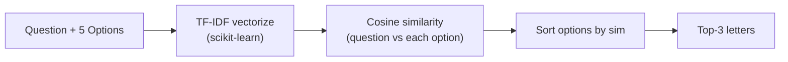

# Cycle 01 別案 (Plan B): Claude 提案の TF-IDF 軽量ベースライン

> **ステータス**: 採用見送り。Cycle 01 は `baseline_proposal.md` (days 7th place 手法) を採用。
> 本案は **手法が複雑すぎて頓挫した場合の fallback** として保存。

## 経緯

- Claude (Opus 4.7) が当初提案したアプローチ
- 提案理由: ユーザーの要件「**サイクルごとに複雑化、最初はアンサンブルなど複雑にしすぎない**」(CLAUDE.md, `requirements.md`) に沿った最小構成
- 不採用理由: ユーザーが days 7th place ソリューションの 3 モデル ensemble を Cycle 01 で実装したいと指示

## 提案内容

### 目的
Cycle 01 では **パイプライン疎通 + CV 計算ロジック確立** を最優先にし、モデル精度は二の次。1 日以内に submission.csv を生成し、Kaggle 提出までフローを通す。

### アーキテクチャ



### コア実装 (~50 行)

```python
"""
# Cycle 01 (alternative)
# Model: TF-IDF + cosine similarity (no retrieval, no LLM)
# Created: 2026-05-26
# Score (CV): ~0.5-0.6 expected
# Notes: minimum viable baseline for pipeline check
"""
import pandas as pd
import numpy as np
from sklearn.feature_extraction.text import TfidfVectorizer
from sklearn.metrics.pairwise import cosine_similarity

def predict_top3(test_df: pd.DataFrame) -> pd.DataFrame:
    options = ["A", "B", "C", "D", "E"]
    rows = []
    for _, r in test_df.iterrows():
        texts = [r["prompt"]] + [r[o] for o in options]
        tfidf = TfidfVectorizer().fit_transform(texts)
        sims = cosine_similarity(tfidf[0:1], tfidf[1:])[0]
        ranked = [options[i] for i in np.argsort(-sims)[:3]]
        rows.append({"id": r["id"], "prediction": " ".join(ranked)})
    return pd.DataFrame(rows)

def map_at_3(y_true, y_pred_top3) -> float:
    scores = []
    for t, p in zip(y_true, y_pred_top3):
        if t in p:
            scores.append(1.0 / (p.index(t) + 1))
        else:
            scores.append(0.0)
    return float(np.mean(scores))

if __name__ == "__main__":
    train = pd.read_csv("data/train/train.csv")
    sub = predict_top3(train)
    pred_lists = [p.split() for p in sub["prediction"]]
    cv = map_at_3(train["answer"].tolist(), pred_lists)
    print(f"CV MAP@3: {cv:.4f}")
    test = pd.read_csv("data/test/test.csv")
    predict_top3(test).to_csv("submission.csv", index=False)
```

### 期待スコア
- CV: **0.5–0.6** 程度（ランダム 0.45 より少し上）
- Public LB: **0.55–0.65**
- 上位陣 0.93+ には程遠いが「ベースラインで自分の最低ラインを把握する」目的は達成

### この案の長所
1. **30 分で実装・実行完了** (依存: scikit-learn のみ)
2. パイプライン全工程 (データ読込 → 予測 → CV 計算 → submission.csv → Kaggle 提出) を疎通
3. 後続 Cycle で「TF-IDF baseline 比 +N%」と相対評価しやすい
4. データ品質チェックにもなる (TF-IDF で見える程度のキーワードマッチが test data に存在するか確認)

### この案の短所
1. retrieval を一切やっておらず、Wiki ベースの設問なので構造上不利
2. モデル学習なし → MAP@3 の本格的なスコアは取れない
3. このまま発展させても 0.7 程度が天井 (上位陣のような ensemble 余地が乏しい)

### Cycle 02 以降の発展案 (Claude 当初提案)

| Cycle | 追加要素 | 期待 MAP@3 |
|---|---|---|
| 02 | Wikipedia subset を TF-IDF retrieval として導入 → context augmentation | 0.7-0.75 |
| 03 | gte-base / e5-base dense retrieval、DeBERTa v3 base で MCQ head 学習 | 0.80-0.85 |
| 04 | DeBERTa v3 large に格上げ、TTA 導入 | 0.85-0.90 |
| 05 | 3 モデル ensemble (今の Cycle 01 案と同等) | 0.92+ |

つまり、本案は **5 サイクル目で達する到達点**を Cycle 01 に持ってきたのが採用案 (days 手法)。トレードオフ:

| 観点 | 採用案 (days 7th) | 別案 (TF-IDF) |
|---|---|---|
| Cycle 01 完了までの時間 | 数日 〜 1 週間 (実装+学習) | 数十分 |
| 完了時のスコア | 0.85+ (簡略版でも) | 0.55-0.65 |
| デバッグ難易度 | 高 (多コンポーネント) | 低 (シンプル) |
| 「サイクルごとに複雑化」原則 | 違反 | 遵守 |
| 学びの幅 | 一気に SOTA 近辺の知見 | 段階的に積み上げ |

## いつこの案に切り戻すか

採用案で以下が起きた場合、本案 (またはより簡略な構成) に戻すことを検討:

- Wikipedia ダウンロードに時間がかかりすぎる (例: 1 日待っても終わらない)
- DeBERTa v3 large の fine-tune が VRAM 不足で動かない (RTX 3080 10GB)
- Cycle 01 完了に 2 週間以上かかる見込み
- ユーザーがパイプライン疎通を優先したいと改めて指示
