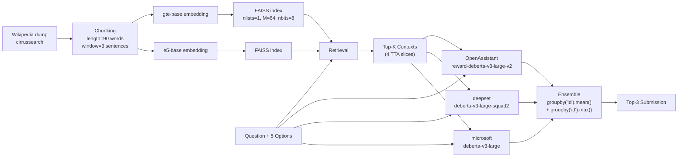

# Cycle 01 ベースライン提案: "days" (7th place) ソリューション

## 出典

- 元記事: [7th Place Solution by team "days" (Kaggle writeup)](https://www.kaggle.com/competitions/kaggle-llm-science-exam/writeups/days-7th-place-solution)
- 一次資料: `data/tmp/ikd_baseline_prop1.md` (ユーザー提供のコピー)
- 派生元 Notebook: @cdeotte の公開ベースライン Notebook (記事中で言及)

## ひとことサマリ

「**Wikipedia (cirrussearch) → 90 word チャンク + FAISS retrieval (gte-base, e5-base) → DeBERTa v3 large 系 3 モデル × 4 組合せ ensemble → TTA + mean+max blending**」で 7 位達成。

> **改変前提**: @cdeotte の baseline Notebook を起点に、4 つの観点 (dataset / retrieval / models / ensemble) を改良。「モデル本体の改良は本質ではない」と判断し、**retrieval 側に最大の投資**。

## アーキテクチャ



## 4 つの改良 (記事より)

### 1. Dataset ⏭️ **Cycle 02 へ繰越** (2026-05-27 ユーザー指示で Cycle 01 から除外)
- 元: `jjinho/wikipedia-20230701` (数値が欠落する問題)
- → **cirrussearch wiki dump** に変更
- **Cycle 01 ではこの改良は行わず、元の wiki dump (`jjinho/wikipedia-20230701` または HF `graelo/wikipedia/20230601.en`) を使う**
- Cycle 02 で cirrussearch に切替、Cycle 01 比のスコア差を測定
- 詳細: `../02/dataset_improvements.md`

### 2. Retrieval
- **評価用データ**: ChatGPT で 250 問の検索評価セット作成（Wikipedia 全体ではなく "a" で始まる項目に限定）
  - 結果: recall@1 = 0.94, recall@30 = 1.0 (限定セット), recall@1 = 0.85 (全 Wiki)
- **テキスト分割**: 90 word 単位、3 文 overlap の sliding window
  - 試した: `(length, window)` ∈ {(60,2), (75,2), (90,2), (90,3), (90,4), (120,4), (150,6)} → LB best で選定
- **FAISS パラメータ**: `nlists=1, M=64, nbits=8`
- **Retrieval モデル**: `gte-base` + `e5-base` (試した: gte/bge/e5 × small/base/large → LB best 採用)
- 注意: retrieval の only-a accuracy は **LB と相関しなかった**

### 3. Model (Scorer)
- 構造: @cdeotte の baseline Notebook とほぼ同じ
- `max_length`: **train=256, inference=786** (train 256 / inf 786 が memory 制約下で最良)
- 比較: train を 256, 384, 512 で試し、inference 768 で評価 → **train 256 がベスト**

#### 学習ハイパラ (HF Trainer)
```python
training_args = TrainingArguments(
    warmup_ratio=0.01,
    learning_rate=1e-6,
    per_device_train_batch_size=2,
    per_device_eval_batch_size=2,
    num_train_epochs=config.epochs,
    report_to='wandb',
    optim="adamw_hf",
    overwrite_output_dir=True,
    fp16=True,
    gradient_accumulation_steps=8,
    load_best_model_at_end=True,
    metric_for_best_model="eval_map@3",
    lr_scheduler_type="cosine",
    weight_decay=0.01,
    save_total_limit=1,
)
```

#### 採用 3 モデル (DeBERTa v3 large 系)
| HuggingFace ID | 由来 |
|---|---|
| `OpenAssistant/reward-model-deberta-v3-large-v2` | reward model 系 |
| `deepset/deberta-v3-large-squad2` | SQuAD2 で QA fine-tune 済 |
| `microsoft/deberta-v3-large` | プレーン DeBERTa v3 large |

#### 4 つの ensemble 組合せ (model × retrieval × dataset)
- models: 上記 3 種
- retrieval: gte-base / e5-base
- datasets: all / without 3,7,8,9 (低い) / without 10 (高い) — number は記事内ソース ID

### 4. Ensemble
- **TTA**: 検索 ranking の異なるスライスで 4 通り推論
  ```
  TTA1: [0, 1, 2, 3, 4, 5]      (top 6)
  TTA2: [0, 6, 7, 8, 9, 10]     (top 1 + rank 6-10)
  TTA3: [0, 11, 12, 13, 14, 15]
  TTA4: [0, 16, 17, 18, 19, 20]
  ```
- **集計**: 単純平均ではなく **mean + max** の和
  ```python
  df.groupby("id").mean() + df.groupby("id").max()
  ```
  (mean: 安定性, max: 強い信頼の高い予測を伸ばす)

## 効かなかったこと (記事の "Not worked")

- ChatGPT で大量の question 作成 → スコア低下
- CV と LB の相関構築 (`@cdeotte` の 300 行 + test 200 を使ったが相関せず)
- より複雑な TTA
- モデル精度の改善（"retrieval が本質" と判断、深追いせず）

---

## 本プロジェクトでの実装計画 (Cycle 01)

### スコープ判断
記事手法は当初 plan の「TF-IDF 軽量 baseline」より **相応に重い** (Cycle 03 級)。ただしユーザー指示により Cycle 01 として実装。代替案 (TF-IDF) は `alternative_tfidf_baseline.md` に保存。
**Dataset 改良 (cirrussearch 切替) は Cycle 02 に分離**したため、Cycle 01 では Retrieval / Models / Ensemble の 3 改良のみを実装。

### サブステップ (現実的な順序、dataset 改良なし版)
1. **データ取得**: Kaggle 公式 train.csv / test.csv + **元の Wikipedia dump** (HF `graelo/wikipedia/20230601.en` または `jjinho/wikipedia-20230701`)
2. **チャンク化**: 90 word window, 3 sentence overlap (記事の擬似コード)
3. **Retrieval index 構築**: e5-base (まず単一) で FAISS (`nlists=1, M=64, nbits=8`) — gte-base 追加は Cycle 03 へ
4. **公開 train データ拡張**: @radek1 6.5k 等を取得 (任意、なくても疎通可)
5. **1 モデル fine-tune (簡略版)**: `microsoft/deberta-v3-large` を train_max_len=256, fp16, accum=8 で学習 (3 モデルへの拡張は Cycle 03)
6. **TTA 推論**: 2 retrieval slice (`[0,1-5]`, `[0,6-10]`) — 4 slice 化は Cycle 03
7. **Ensemble**: `mean() + max()` で集計（簡略版だと 1 model × 2 TTA = 2 予測の集約）
8. **submission.csv 生成 → 1 日 1 回 提出**

### RTX 3080 10GB での実現性

| 工程 | VRAM 見積 | 注意 |
|---|---|---|
| Wikipedia embedding (gte-base / e5-base) | ~2-3GB | CPU でも可、GPU で 10x 高速 |
| FAISS index 構築 | RAM 主体 | nlists=1 はメモリ食い、cirrussearch full は分割必要かも |
| DeBERTa v3 large fine-tune (bs=2, fp16, accum=8, gc on) | ~8-9GB | ギリ収まる |
| DeBERTa v3 large 推論 (max_len=786) | ~6GB | OK |

→ **可能だが、Wikipedia 全体を扱うのはディスク・RAM 的に厳しい**。最初は **Wikipedia subset** (例: STEM 関連カテゴリのみ) で動作確認 → スケールアップが現実的。

### リスクと簡略化オプション
- ⚠️ cirrussearch wiki dump は ~80GB 圧縮 → 全 retrieve は困難
  - **簡略**: HuggingFace `graelo/wikipedia/20230601.en` (整形済) を使う
- ⚠️ 3 モデル × 4 組合せ ensemble は学習に GPU 数日かかる
  - **簡略**: まず 1 モデル (`microsoft/deberta-v3-large`) + 1 retrieval (`e5-base`) のみで疎通確認
- ⚠️ 公開 train データ統合の前処理が複雑
  - **簡略**: 公式 train.csv の 200 行 + @radek1 の 6.5k のみで開始

### Cycle 01 完了の定義
- `submission.csv` が生成され、ローカルで MAP@3 が計算できる
- ensemble の `mean()+max()` ロジックが正しく動く
- CV >= 0.7 (記事は LB 0.92+ だが、簡略構成なら 0.7-0.8 が現実的)

### Cycle 02 以降の伸びしろ
- Wikipedia subset → full に拡張
- ensemble の組合せを 4 通りすべて回す
- データ拡張（GPT-5 / Claude 4.7 で synthetic）
- bge-reranker 追加

## 参考リンク
- [days 7th place writeup (元記事)](https://www.kaggle.com/competitions/kaggle-llm-science-exam/writeups/days-7th-place-solution)
- [@cdeotte ベースライン Notebook (派生元、要 Kaggle ログイン)](https://www.kaggle.com/code/cdeotte/starter-notebook-ranked-public-lb)
- [@radek1 6.5k GPT-3.5 dataset](https://www.kaggle.com/datasets/radek1/sci-or-not-sci-hypthesis-testing-pack)
- ensemble 詳細: `knowledge/01/ensemble_methods.md`
- 代替案 (TF-IDF baseline): `knowledge/01/alternative_tfidf_baseline.md`
