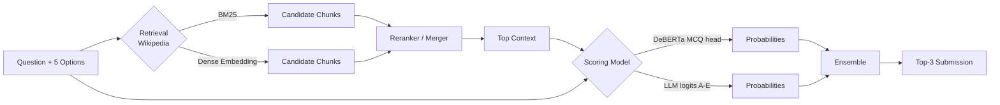

# 01. 全体傾向 — Kaggle "LLM Science Exam" 上位陣の共通パターン

> 出典: [Hippocampus's Garden — Kaggle Competition Report: LLM Science Exam](https://hippocampus-garden.com/kaggle_llm/) を主軸に、複数の公開 GitHub solution / Discussion を統合。

## 1. 勝ち筋 = "RAG × DeBERTa or LLM × Ensemble"

上位陣は **ほぼ全員** が以下のパイプライン:

## 2. 採用された主要技術 (頻度順、推定)

| 技術 | 採用率 | 補足 |
|---|---|---|
| **Wikipedia をコーパスとした RAG** | ~100% (上位 20+) | 設問が Wiki ベースで生成されているため、強い retrieval が決定的 |
| **DeBERTa v3 (large/base) で MCQ** | 80% 以上 | 当時のサイズ vs 精度のコスパが最良 |
| **BM25 (Apache Lucene / Pyserini / Elasticsearch)** | 60-70% | sparse retrieval は keyword 一致に強い |
| **Dense Embedding (BGE, GTE, MiniLM, e5)** | 60-70% | semantic 検索で BM25 を補完 |
| **Hybrid Retrieval (BM25 + Dense + Rerank)** | 上位ほど高い | 単独より hybrid が一貫して強い |
| **Cross-encoder / DeBERTa reranker** | 40% | retrieve した上位 N を再順位付け |
| **Llama 2 / Mistral 7B / 13B / 70B のファインチューン** | 上位 5 中 3 チーム | 7B-13B が現実的、70B はメモリ最適化必須 |
| **LoRA / QLoRA / 4bit 量子化** | 必須レベル | Kaggle 9h 制限内で 70B を回すための前提 |
| **GPT-3.5 で訓練データを大量自動生成** | ほぼ全員 | 公式 train.csv は 200 行のみ |
| **モデル × Retrieval パラメータの Ensemble** | 90% | 1モデル単独で勝った例はほぼ無し |

## 3. 共通の落とし穴

- **CV と LB のギャップ**: 自前生成データの分布バイアスで CV が過大になりやすい。MMLU などドメイン外で検証する工夫が必要。
- **Notebook 9h 制限**: 70B を素直に動かすと OOM か timeout。`past_key_values` キャッシュ、xFormers attention 等の最適化が不可欠。
- **Top-3 順序**: MAP@3 は順序依存。確信度の高いものを 1 位に置かないと最大 -0.667 損する。
- **Wiki 検索の rare topic 漏れ**: ニッチな科学トピックに rare entity が含まれると BM25 だけだと拾えない → dense 必須。

## 4. メタゲーム的洞察

| 観察 | 含意 |
|---|---|
| **データ量** が決定的 (200 → 6k → 150k へ augment) | 「クリーンなデータ生成パイプライン」が事実上 1 つの実験対象 |
| Retrieval は **再現性** が大事 | retrieve 結果のキャッシュ / FAISS index は早めに固定 |
| DeBERTa v3 large は 70B LLM に **競り勝つ場面が多い** | 「大きいモデル = 強い」ではない (コンテキスト品質次第) |
| **0.92 がボーダー** (上位 100 ライン)、0.93+ がメダル | TF-IDF only ベースラインは 0.6〜0.7、RAG+DeBERTa で 0.85+ に届く |

## 5. 本プロジェクトの Cycle 計画 (現状)

1. **Cycle 01**: **days 7th place 解法のうち「Retrieval / Models / Ensemble」3 改良** を実装 (元 wiki dump 使用)。
   - 詳細: `knowledge/01/baseline_proposal.md`、ensemble: `knowledge/01/ensemble_methods.md`
   - 簡略構成 (1 model × 1 retrieval × 2 TTA) で疎通 → 段階的拡張
   - 当初提案の軽量 TF-IDF 案は `knowledge/01/alternative_tfidf_baseline.md` に fallback として保存
2. **Cycle 02**: **Dataset 改良** — wiki dump を `jjinho/wikipedia-20230701` → **cirrussearch** に切替 (数値欠落の解決)。Cycle 01 比のスコア差で効果測定。
   - 詳細: `knowledge/02/dataset_improvements.md`
3. **Cycle 03**: モデル多様化 (DeBERTa v3 large 3 種 + gte-base 追加 + TTA を 4 slice にフル化)
4. **Cycle 04**: データ拡張 (radek1 6.5k / cdeotte MMLU / Claude Opus 4.7 synthetic)
5. **Cycle 05+**: 2026 視点での近代化 — ModernBERT 8K context / bge-reranker-v2-m3 / Qwen 3 8B (unsloth LoRA) — `08_critique_modern_ai.md` 参照

## 関連

- 各順位の詳細: `02_kaggler_h2o_llm_studio.md` 〜 `06_kaggler_preferred_oshaberinbo.md`
- 銀メダル以下の参考: `07_other_notable_approaches.md`
- 2026 年視点での批評: `08_critique_modern_ai.md`
- **Cycle 01 採用案**: `01/baseline_proposal.md`
