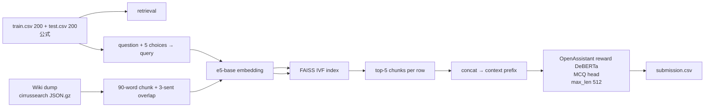

# Cycle 02: Cycle 01 振り返り + 改善案

> Cycle 02 では「Wikipedia retrieval を入れる」「dataset を cirrussearch に切替える」の 2 軸を同時に積む。
> このドキュメントは **Cycle 01 の 3 提出から何が言えるか** と、それを踏まえた **02 で打つ手の優先順位** を整理する。
> retrieval 自体の設計は [[wikipedia_retrieval_plan]] に分離、dataset 切替は既存の [[dataset_improvements]] に詳細あり。

最終更新: 2026-05-28

---

## 1. Cycle 01 の事実関係

### 1-1. 提出 3 件のスコア（再掲、提出物との対応つき）

| # | submit/ dir | Kaggle kernel slug | submission ref | submit date | backbone (HF repo) | val MAP@3 | Public LB | Private LB | wall (Kaggle T4) |
|---|---|---|---|---|---|---|---|---|---|
| m1 | `submit/01_m1_microsoft/` | `kunihiro1997/llm-science-exam-01-v1-baseline` | 53093495 | 2026-05-27 | `microsoft/deberta-v3-large` (plain) | 0.4708 | 0.388056 | 0.378399 | ~3.4 min |
| **m2** | `submit/01_m2_openassistant/` | `kunihiro1997/llm-science-exam-01-v1-m2-openassistant-reward` | 53113415 | 2026-05-28 | `OpenAssistant/reward-model-deberta-v3-large-v2` | **0.7958** | **0.682480** | **0.714337** | ~3.4 min |
| m3 | `submit/01_m3_deepset/` | `kunihiro1997/llm-science-exam-01-v1-m3-deepset-squad2` | 53113423 | 2026-05-28 | `deepset/deberta-v3-large-squad2` | 0.6458 | 0.592176 | 0.605449 | ~3.4 min |

- 3 件とも **コード本体 (`01_v1_*.py`) は完全に同一**。違いは `kernel-metadata.json` の `dataset_sources` 1 行のみで、それが backbone の HF repo に対応する Kaggle Dataset を指す。
- Public LB に乗っているのはこの 3 件のみ（`kaggle competitions submissions kaggle-llm-science-exam` で実機照会済）。multi-model ensemble は **未提出**（Cycle 03 へ）。
- 詳細・コード差分: `submit/01_*/`, `report/01_score_report.md`, `report/01_submissions_summary.md`。

### 1-2. 観察された事実

1. **同一コード、同一ハイパラ、違うのは backbone weights のみ** → スコアの差は完全に「事前学習の質」由来。
2. **val (0.47-0.79) と LB (0.38-0.68) の順位は完全一致**、スケールも保たれている → val が信頼できるシグナルである（Cycle 02 でも val を意思決定に使える）。
3. **Public ≤ Private（m2/m3）**: 過学習リスク低、汎化はむしろ test の方が良い。
4. **wall time が 1 提出 3.4 分しかない** → 9h GPU 上限まで余裕 ≒ 100×。retrieval 追加・ensemble・TTA を入れても時間制約には当たらない。
5. **200 行 train での 3 epoch fine-tune では plain backbone (m1) の能力が引き出せない**。中間 pretrain (RLHF reward, QA) を経たものが圧倒。

### 1-3. パイプライン上のボトルネック仮説

- **m2 ≫ m3 ≫ m1** のスコア差 ≒ 「事前知識を選択肢に転写する能力」の差。Wikipedia 由来の固有名詞・年代・公式・定数を **訓練時に見せていない** ので、知識質の差が直接スコアに出ている。
- **retrieval が無い** ことが上限を決めている。MCQ の選択肢を判別するには問題文と Wiki テキストの突き合わせが必要だが、現状は backbone の暗記頼り。
- val/LB のギャップ ≈ 0.08-0.10。これは「train の 200 行と test の分布差」+ 「val が train と同分布なので甘め」由来と推定。**train を増やす** か **distribution を test に寄せる** ことでこのギャップは詰まる。

---

## 2. Cycle 02 で打てる手 (12 候補)

ボトルネック仮説 (1-3) から導かれる打ち手を **効果見込み × 実装コスト** で並べる:

| # | 打ち手 | 期待 ΔLB | 実装コスト | 依存 | コメント |
|---|---|---|---|---|---|
| **A** | Wikipedia retrieval (e5-base + FAISS) を MCQ に context 注入 | **+0.10–0.20** | 中 | dump 取得・index 構築 | **本 Cycle の主役**。詳細 → [[wikipedia_retrieval_plan]] |
| **B** | dataset を cirrussearch に切替（数値・公式の欠落解消） | +0.02–0.05 | 中 | A と同時運用 | A と組み合わせ前提。詳細 → [[dataset_improvements]] |
| **C** | core backbone を **m2 (OpenAssistant reward)** に固定 | (再現性) | 低 | A の前段 | Cycle 01 で確定済の知見をそのまま採用 |
| D | train データ拡張 (radek1 6.5k + cdeotte MMLU + synthetic) | +0.03–0.06 | 中 | (none) | Cycle 04 に回す予定だが、retrieval 効果と切り分け難しいので 02 では入れない |
| E | epochs 3→5–8 へ伸ばす（200 行では収束していない可能性） | +0.01–0.03 | 低 | (none) | 同じ pipeline で安価に試せるので A の後に実験 |
| F | max_length 384→512 へ拡大（retrieval context 入る分の余裕） | +0.01–0.03 | 低 | A | A 必須。B 用にも有用 |
| G | 推論時 TTA (4 slice = 異なる context 切り出し) | +0.01–0.02 | 中 | A | Cycle 03 で本格化、02 はスキップ |
| H | m2 + m3 + m1 の ensemble (mean / max) | +0.01–0.04 | 低 | (none) | retrieval 効果と切り分け難しいので Cycle 03 に分離 |
| I | re-ranker (bge-reranker-v2-m3) を retrieval 後段に追加 | +0.02–0.04 | 中 | A | Cycle 02 v2 で検討 |
| J | context-window-aware sliding (chunk ごとに推論 → 集約) | +0.02–0.05 | 中 | A | F 採用後の自然な次手、Cycle 02 v2 |
| K | bf16 → fp16 のみ T4 は持つ、precision tuning | (微) | 低 | (none) | Cycle 01 で fp16 確定済、これ以上は不要 |
| L | learning rate / warmup の hyperparam sweep | +0.00–0.01 | 中 | (none) | 効果薄い割にコスト高、後回し |

### 取捨選択の基準

- **02 は "なぜ効くかが明確で、効果が大きい" 1-2 個に絞る**。あれもこれも入れると効果切り分け不能で次 Cycle の判断材料が壊れる。
- **A と B は同時投入する**（02 のスコープ宣言通り）。両方とも「retrieval 経路の質を上げる」共通テーマで、内部依存もあるため切り分けは「B あり/なしの ablation を 1 本走らせる」で達成可。
- **C (core m2) は無コストで効くので確定**。
- D, G, H は **明らかに効くが効果切り分け不能** → 別 Cycle (03, 04) に分離。
- E, F は **A の副作用として必要なら入れる**（特に F は retrieval context を切らないために実質必須）。

---

## 3. Cycle 02 採用案（v1 / v2 案）

### 3-1. v1（最小構成、ablation 重視）

| 項目 | 値 |
|---|---|
| Backbone | `OpenAssistant/reward-model-deberta-v3-large-v2` (= Cycle 01 m2) |
| Corpus | cirrussearch wiki dump (STEM filter or 月別小型 dump) |
| Chunker | 90 word, 3 sentence overlap (days 7th 派生) |
| Embedder | `intfloat/e5-base-v2` (or `BAAI/bge-base-en-v1.5`) |
| Index | FAISS IVF (`nlist=1, M=64, nbits=8`) |
| Retrieval top-k | 5 chunks / row |
| Context 注入方式 | `prompt = "[CTX] {top5_concat}\n\n[QUESTION] {q}\n[CHOICE] {o}"` |
| max_length (train/infer) | 384 / 512 |
| epochs | 3 (Cycle 01 と同じ、F の効果と分離するため) |
| TTA / ensemble | なし |
| Ablation | (a) context あり, (b) context なし の 2 サブ提出で Δ を測る |

### 3-2. v2（v1 が回ったら追加実験）

- F (max_length 512 を確定): v1 で既に効いていれば固定
- E (epochs 5–8 試行)
- 簡易 re-ranker (cross-encoder で top-20 → top-5)
- ablation: dump 種別 (cirrussearch vs jjinho) のみ差し替え → B 単独の Δ 測定

---

## 4. ベスト案 考察（02 全体）

### 4-1. 「最も時間あたりの期待 LB が大きい構成」

- **A + B + C + F の 4 点同時投入が最善**。理由:
  - A の retrieval が **boost の主軸**（CV +0.10 想定）。
  - B (cirrussearch) は A の retrieval 品質を **無料で底上げ** する（A の前提作業が同じため追加コストほぼ 0）。
  - C は Cycle 01 で既に確定済の最強 backbone（追加コスト 0、リスク 0）。
  - F は context を切らないために実質必須（A を入れる以上、max_length を増やさないと context を半分捨てることになる）。

### 4-2. リスクと回避策

| リスク | 回避策 |
|---|---|
| cirrussearch dump 取得が WSL2 DL 帯域で詰む | **DL 高速化（mirrored networking）を先に解決**（並行作業中）。それでも遅ければ Windows 側で aria2c |
| FAISS index 構築の embedding に時間がかかる | embedder は GPU 推論、batch 大きめ、`fp16=True`。1 GPU で数時間想定。失敗時は STEM サブセットに縮退 |
| A + B 同時投入で効果切り分け不能 | v1 で「(a) context あり / (b) context なし」の 2 サブ提出を必ず行い Δ を測る |
| Kaggle Notebook の input サイズ上限 (20GB) | cirrussearch を一旦 parquet に整形し、Kaggle Dataset として upload する。dump 全 200GB は乗せず、retrieval 済 top-k context を train/test 側に持たせる方式も可（Cycle 02 v2 で検討） |

### 4-3. Cycle 02 完了の定義

- `submit/02_*/` に少なくとも **(a) retrieval あり** の 1 提出 + **(b) retrieval なし (Cycle 01 m2 再現)** の対照 1 提出
- `report/02_score_report.md` に「retrieval 有無の Δ」「cirrussearch 有無の Δ（v2 で）」を明記
- `task_board.md` の Cycle 02 を Done に移し、Cycle 03 (ensemble) の前提条件（v2 値 + retrieval pipeline 再利用可能性）を確認

## 関連

- [[wikipedia_retrieval_plan]] — retrieval 設計の詳細（このドキュメントの A 部分）
- [[dataset_improvements]] — cirrussearch 切替の詳細（B 部分）
- `report/01_score_report.md`, `report/01_submissions_summary.md` — Cycle 01 結果
- `knowledge/01/baseline_proposal.md` — days 7th 派生の元案
- `knowledge/search/00_ensemble_pipeline_origin_validity.md` — 「強い single → 多様性」の戦略順序の根拠
