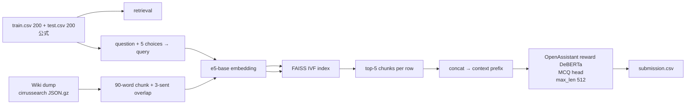

# Cycle 02: モデルの構成案

> **このドキュメントのシリーズ**: (1) [[cycle01_1_models_overview]] 提出モデル概要 → (2) [[cycle01_2_results_and_analysis]] 結果と考察 → (3) [[cycle01_3_challenges]] 課題 → **(4) 本ファイル＝02 構成案**
>
> 本ファイルの守備範囲: **(3) で確定した打ち手 A+B+C+F を具体的なパイプライン・spec・実験設計・リスク対策に落とす**。retrieval 自体の設計詳細は [[wikipedia_retrieval_plan]]、dump 切替は [[dataset_improvements]] に分離。

最終更新: 2026-05-29（`cycle01_retrospective_and_v2_plan.md` を 4 分割して作成）

> Cycle 02 のスコープ: 「Wikipedia retrieval を入れる (A)」「dataset を cirrussearch に切替える (B)」の 2 軸を同時に積む。backbone は m2 固定 (C)、max_length 拡大 (F)。

---

## 0. RAG パイプラインの全体像（LLM 学習用の前提）

Cycle 02 で初めて入れる **RAG (Retrieval-Augmented Generation / ここでは Retrieval-Augmented MCQ)** の各部品が何をするか。

```
                       ┌── (オフライン: 一度だけ) ──────────────────┐
 Wikipedia dump  ─►  chunk 分割  ─►  embedder ─►  ベクトル化 ─►  FAISS index
 (cirrussearch)      90word/3sent   (e5-base)    各chunk=1ベクトル   (検索用DB)
                       └────────────────────────────────────────────┘
                                                                  ▲ 類似検索
 設問(question+5択) ─► query 文 ─► 同じ embedder でベクトル化 ───────┘
                                                                  │ top-5 chunk
                                                                  ▼
   [CTX] 引いた文章 + [QUESTION] 設問 + [CHOICE] 選択肢 ─► m2 DeBERTa(MCQ) ─► submission.csv
```

### 📘 各部品の役割

- **chunk 分割**: Wikipedia 記事は長いので、検索の単位に切る。大きすぎると検索精度が落ち、小さすぎると文脈不足（[`../search/02_rag_accuracy_quantitative_impact.md`](../search/02_rag_accuracy_quantitative_impact.md) §3.3）。本案は **90 word + 3 sentence overlap**（隣接 chunk と少し重ねて境界の取りこぼしを防ぐ）。
- **embedder（埋め込みモデル）**: 文章を「意味が近いものは近いベクトルになる」固定長ベクトルに変換するモデル。本案は `intfloat/e5-base-v2`。**設問側と文書側を同じ embedder で変換**するから、ベクトルの近さ＝意味の近さとして検索できる。**具体例**: 設問 *"What causes ocean tides?"* をベクトル化すると、Wikipedia "Tide" 記事の *"...the gravitational pull of the Moon..."* という chunk のベクトルとは**近く**（cos 類似度が高い）、無関係な "Photosynthesis" 記事の chunk とは**遠く**なる。だから top-k 検索で前者が引かれる。
  - 📘 embedder の質は効く: 同一パイプラインで embedder だけ差し替えた ablation で Public MAP@3 が 0.03 ぶれた実例あり（[`../search/02_rag_accuracy_quantitative_impact.md`](../search/02_rag_accuracy_quantitative_impact.md) §1.3）。本コンペで 0.03 は数百順位差。
- **FAISS index**: 数百万 chunk のベクトルから「query に近い top-k」を高速に探す近似最近傍探索 (ANN) ライブラリ。全件と総当たりすると遅いので、IVF（ベクトル空間をクラスタに区切り、近いクラスタだけ探す）で近似する。
- **context 注入**: 引いた top-5 chunk を設問の前に貼り付けて DeBERTa に渡す。これが「参考書を開いて解く」状態。**具体例**（§1 の注入方式で 1 行を組み立てると）:

  ```
  [CTX] Radium was discovered in 1898 by Marie and Pierre Curie ... It is a
        radioactive alkaline earth metal ... (top-5 chunk を連結)
  [QUESTION] In what year was the element radium discovered?
  [CHOICE] 1898
  ```
  この `[CTX]…[QUESTION]…[CHOICE]…` を選択肢 5 本ぶん作って MCQ head に通す（(1) [[cycle01_1_models_overview]] §2 の 5 本入力と同じ形）。closed-book では `[CTX]` が空だったところに、根拠文が入るのが Cycle 02 の差分。
- **(後段オプション) re-ranker**: → §2 v2。検索の top-k を **より精密なモデル (cross-encoder)** で並べ直してノイズを除く。

### 📘 ablation（アブレーション）— 純効果の測り方

「ある要素を入れた/外した以外は全部同じ」2 つを走らせ、スコア差をその要素の純効果とみなす実験法。Cycle 02 では **「context あり」「context なし」の 2 サブ提出**を必ず作り、その差 = retrieval の純効果として (2) の仮説 H2 を検証する。これをやらないと「retrieval が効いたのか他の変更が効いたのか」が永久に分からなくなる。

**具体例（数値で）**: backbone も chunk も max_length も全部同じにして、(a) context あり = Public 0.78、(b) context なし = Public 0.68 が出たら、**Δ = +0.10 が retrieval の純効果**と読める。逆に (b) も 0.68 のまま (a) が 0.69 にしか上がらなければ「retrieval はこの設定ではほぼ効いていない」と判定でき、次は embedder や top-k を疑う、と切り分けが進む。

---

## 1. v1（最小構成、ablation 重視）



| 項目 | 値 | 根拠 |
|---|---|---|
| Backbone | `OpenAssistant/reward-model-deberta-v3-large-v2` (= Cycle 01 m2) | 打ち手 C。[[cycle01_1_models_overview]] で最強確定 |
| Corpus | cirrussearch wiki dump (STEM filter or 月別小型 dump) | 打ち手 B。[[dataset_improvements]] |
| Chunker | 90 word, 3 sentence overlap (days 7th 派生) | §0 chunk の根拠 |
| Embedder | `intfloat/e5-base-v2` (or `BAAI/bge-base-en-v1.5`) | §0 embedder の根拠 |
| Index | FAISS IVF (`nlist=1, M=64, nbits=8`) | §0 FAISS の根拠 |
| Retrieval top-k | 5 chunks / row | 入れすぎず適量（§0 long-context 劣化の注意） |
| Context 注入方式 | `prompt = "[CTX] {top5_concat}\n\n[QUESTION] {q}\n[CHOICE] {o}"` | — |
| max_length (train/infer) | 384 / 512 | 打ち手 F。context を切らないため |
| epochs | 3 (Cycle 01 と同じ) | F の効果と分離するため据え置き |
| TTA / ensemble | なし | Cycle 03 に分離（[[cycle01_3_challenges]] §3） |
| Ablation | **(a) context あり, (b) context なし の 2 サブ提出で Δ を測る** | §0 ablation。仮説 H2 の検証 |

---

## 2. v2（v1 が回ったら追加実験）

- **F (max_length 512 を確定)**: v1 で既に効いていれば固定
- **E (epochs 5–8 試行)**: 200 行で未収束なら伸びる可能性
- **簡易 re-ranker**: cross-encoder で top-20 → top-5 に絞る。§0 の distraction 対策・ノイズ除去（[`../search/02_rag_accuracy_quantitative_impact.md`](../search/02_rag_accuracy_quantitative_impact.md) §3.2）
- **ablation: dump 種別 (cirrussearch vs jjinho) のみ差し替え** → 打ち手 B 単独の Δ 測定

---

## 3. ベスト案 考察（02 全体）

### 3-1. 「最も時間あたりの期待 LB が大きい構成」

- **A + B + C + F の 4 点同時投入が最善**。理由:
  - A の retrieval が **boost の主軸**（CV +0.10 想定、[`../search/02_rag_accuracy_quantitative_impact.md`](../search/02_rag_accuracy_quantitative_impact.md) §2）。
  - B (cirrussearch) は A の retrieval 品質を **無料で底上げ**（A の前提作業が同じため追加コストほぼ 0）。
  - C は Cycle 01 で既に確定済の最強 backbone（追加コスト 0、リスク 0）。
  - F は context を切らないために実質必須（A を入れる以上、max_length を増やさないと context を半分捨てることになる）。
- wall time の余裕: Cycle 01 は 1 提出 3.4 分で 9h 上限の ~100× 余裕（[[cycle01_2_results_and_analysis]] の観察）。retrieval・index 構築を足しても時間制約には当たらない。

### 3-2. リスクと回避策

| リスク | 回避策 |
|---|---|
| cirrussearch dump 取得が WSL2 DL 帯域で詰む | **DL 高速化（mirrored networking）を先に解決**。それでも遅ければ Windows 側で aria2c。HF/dump 取得は `scripts/prefetch_hf_model.py` 経由が最速（CLAUDE.md §6） |
| FAISS index 構築の embedding に時間がかかる | embedder は GPU 推論、batch 大きめ、`fp16=True`。1 GPU で数時間想定。失敗時は STEM サブセットに縮退 |
| A + B 同時投入で効果切り分け不能 | v1 で「(a) context あり / (b) context なし」の 2 サブ提出を必ず行い Δ を測る（§0 ablation） |
| retrieval context が長すぎて逆に劣化 | top-k=5 / max_len 512 に抑える。§0 の long-context 劣化（arXiv 2510.05381）を踏まえた適量設計 |
| Kaggle Notebook の input サイズ上限 (20GB) | cirrussearch を一旦 parquet に整形し Kaggle Dataset として upload。dump 全 200GB は乗せず、retrieval 済 top-k context を train/test 側に持たせる方式も可（v2 で検討） |

### 3-3. Cycle 02 完了の定義

- `submit/02_*/` に少なくとも **(a) retrieval あり** の 1 提出 + **(b) retrieval なし (Cycle 01 m2 再現)** の対照 1 提出
- `report/02_score_report.md` に「retrieval 有無の Δ」「cirrussearch 有無の Δ（v2 で）」を明記
- `task_board.md` の Cycle 02 を Done に移し、Cycle 03 (ensemble) の前提条件（v2 値 + retrieval pipeline 再利用可能性）を確認

---

## 4. Cycle 02 レポートの R1–R5 規約への適合（前向きガイド）

> ⚠️ これは **Cycle 02 のレポート (`report/02_score_report.md`) を書くときの TODO** であって、Cycle 01 の考察ではない。Cycle 01 の R1–R5 考察は [[cycle01_2_results_and_analysis]] にある。

[`../README.md`](../README.md) のレポート規約 R1–R5 に従い、`report/02_score_report.md` は以下を満たすこと:

1. **R1**: ベースラインスコア (val MAP@3) を明記。**Cycle 02 では KFold (5-fold, val=200) への移行を前提に「val_kfold MAP@3」と「Cycle 01 互換の val_holdout MAP@3 (val=40)」の両方を出す**（本 Cycle で val 設計を変えるため両方残す必要がある）。
2. **R2**: Public/Private LB の特徴を、Cycle 01 m2 (Public 0.682 / Private 0.714) と比較する形で記載。
3. **R3**: 「retrieval あり/なし」で **どの設問群が改善したか / しなかったか** を誤答ログから抽出して列挙（数値含有有無、prompt 長帯、選択肢間 Levenshtein 距離など観測可能な特徴で）。
4. **R4**: Cycle 01 で記録した val ↔ Public/Private の構造（[[cycle01_2_results_and_analysis]] §5）と、Cycle 02 の val_kfold ↔ Public/Private の構造を **並べて比較**。retrieval 導入で Δ がどう変化したかをデータレベルで論じる。
5. **R5**:
   - Δ_Public, Δ_Private を全提出 (a)/(b) 分すべて記載
   - **Δ_(a) − Δ_(b) = retrieval 純効果** を別途明示
   - Cycle 02 v1 の Δ ターゲット (Δ_Public ≤ −0.05) に対する達成可否を判定
   - 達成失敗時は仮説 H1 (val ノイズ) / H2 (long-tail 設問) / H3 (Public 分布偏り) のどれが残ったかを切り分けて記載

---

## 関連

- [[cycle01_3_challenges]] — 本構成案の根拠となる打ち手 A/B/C/F の選定
- [[cycle01_2_results_and_analysis]] — 検証する仮説 H1/H2 とスコア構造
- [[cycle01_1_models_overview]] — backbone m2 固定 (C) の根拠
- [[wikipedia_retrieval_plan]] — retrieval 設計の詳細（A 部分）
- [[dataset_improvements]] — cirrussearch 切替の詳細（B 部分）
- `report/01_score_report.md`, `report/01_submissions_summary.md` — Cycle 01 結果
