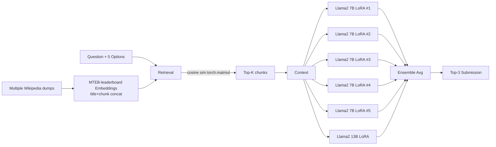

# 02. 1st place — Team H2O LLM Studio (RAG + LLM ensemble)

## 概要

H2O.ai 公式チーム。RAG パイプライン × LoRA-finetuned 中規模 LLM ×6 個 (7B×5 + 13B×1) のアンサンブルで圧勝。

## アーキテクチャ

## 主要テクニック

- **Retrieval**: 複数の Wikipedia ダンプ + MTEB leaderboard 上位の embedding モデル数種を使い分け。title + chunk を **結合してから embedding** することで title weight を底上げ。
- **Scoring 形式**: 二値分類「Context が与えられたとき、この選択肢は正解か?」を 5 選択肢それぞれに対して LLM ロジットで判定。
- **LoRA 線形層のみ fine-tune**: 計算効率が極めて高い。
- **`past_key_values` cache**: context と question 部分は同一なので KV cache を保持して各選択肢の推論を高速化。Kaggle 9h 制限突破に決定的。
- **データ**: 公開された `radek1` の **GPT-3.5 生成 6.5k サンプル**を主に学習。
- **モデル多様性**: Llama 2 7B を5個（異なるシード/embedding/context 件数）+ 13B 1個。

## 使用モデル / データ

- Reasoning: **Llama 2 7B ×5 + 13B ×1**, LoRA 部分のみ学習
- Retrieval: MTEB top 系 embedding（具体名は writeup 参照）
- 訓練: `radek1` 6.5k GPT-3.5 dataset + 関連公開

## スコア

- Private LB: 0.93+ 帯（1 位）

## 独自の工夫

1. **KV cache reuse** で context+question を 1 回だけエンコード → 5 選択肢の推論コストを 1/5 に
2. Embedding の **title concat** trick
3. **多様なシード/モデルの素朴な average** で十分強い ensemble を構築

## 参考リンク

- [Team H2O LLM Studio 1st place writeup](https://www.kaggle.com/competitions/kaggle-llm-science-exam/writeups/team-h2o-llm-studio-1st-place-solution)
- [H2O LLM Studio (open source)](https://github.com/h2oai/h2o-llmstudio)

## 2026 年視点での批評

- ✅ **今でも有効**: KV cache 再利用は 2026 でも有効（vLLM / SGLang は自動でやってくれる）。Embedding の title weighting 工夫も依然有効。RAG 自体の枠組みもそのまま。
- ⚠️ **当時の制約**: Llama 2 7B/13B は今や弱い。LoRA も unsloth / DoRA / GaLore で 2-5x 高速化。9h 制限内で 70B は厳しかったが、今は Qwen 3 32B / Llama 4 Scout 17B-MoE がフィット。
- 🔄 **現代の置き換え**:
  - Llama 2 7B ×5 → **Qwen 3 8B または Llama 4 Scout** ×3〜5（同じ計算量で精度が遥かに上）
  - Llama 2 13B → **DeepSeek V3 reasoning モード** または **Claude Haiku 4.5 API**（Kaggle 制限外ならば）
  - MTEB embeddings → **BGE-M3 / NV-Embed-v2 / Voyage-3** (multilingual+long context)
  - 二値分類スコア化 → **直接 LLM に top-3 を答えさせる prompting** + reasoning tokens
  - 6.5k 学習データ → GPT-5 / Claude Opus 4.7 で **100k+ の高品質 synthetic** が現実的
- 💡 **学べる教訓**: 「context 品質 × ensemble 多様性」の組合せ最適化は普遍。逆に「単一の最強モデル」依存は脆い。
