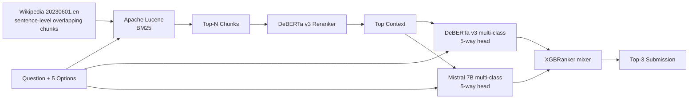

# 03. 2nd place — @solokin (Solo, BM25 + DeBERTa + Mistral hybrid)

## 概要

ソロ参戦。古典的 BM25 と DeBERTa reranker、そして Mistral との multi-class 分類アンサンブルで 2 位。

## アーキテクチャ

## 主要テクニック

- **Wikipedia sentence-level chunking** + overlap: 細かい単位で index、recall を底上げ
- **Apache Lucene の BM-25** をフルパワーで利用（pyserini ではなく Lucene 直）
- **DeBERTa v3 reranker** で retrieve 結果を semantic で再順位付け
- **Scoring 側は 5-way multi-class 分類** (A-E のいずれかを直接出力)
- **DeBERTa と Mistral の出力を XGBRanker でブレンド** → LR や mean より精度的に有利
- データは「標準的な augmentation source より大きい curated dataset」を用意

## 使用モデル / データ

- Reranker: DeBERTa v3 (large 推定)
- Scorer: DeBERTa v3 (multi-class head) + Mistral 7B (multi-class head)
- Mixer: XGBRanker
- コーパス: Wikipedia 20230601.en

## スコア

- Private LB: 0.93+ 帯（2 位）

## 独自の工夫

1. **古典 BM25 を侮らない** — Lucene を真面目にチューニングすれば dense と互角
2. **Reranker と Scorer の役割分離** — 役目が違うモデルを直列に重ねる
3. **XGBRanker for output mixing** — 単純平均ではなく学習した順位ロスで blending

## 参考リンク

- [2nd place writeup (Kaggle Discussion)](https://www.kaggle.com/competitions/kaggle-llm-science-exam/discussion) （要 Kaggle ログイン）

## 2026 年視点での批評

- ✅ **今でも有効**: 「sparse + dense + rerank」の hybrid retrieval は 2026 でも最強パターン。Lucene/OpenSearch も生き残っている。
- ⚠️ **当時の制約**: Mistral 7B は基準モデルとしては古い。XGBRanker mixing は学習データが少ないと過学習する。
- 🔄 **現代の置き換え**:
  - DeBERTa v3 reranker → **bge-reranker-v2-m3** や **Cohere Rerank 3** （後者は API 必要）
  - Mistral 7B → **Mistral Large 2 / Qwen 3 7B-Instruct**
  - XGBRanker mixer → **stacking with light LightGBM** or 直接 LLM judge
  - sentence-level BM25 → 同じ思想で **late-interaction (ColBERT v2)** に乗り換える価値あり
- 💡 **学べる教訓**: ソロでもメダル取れる = 計算資源より「設計の素直さ」と「データの質」。
