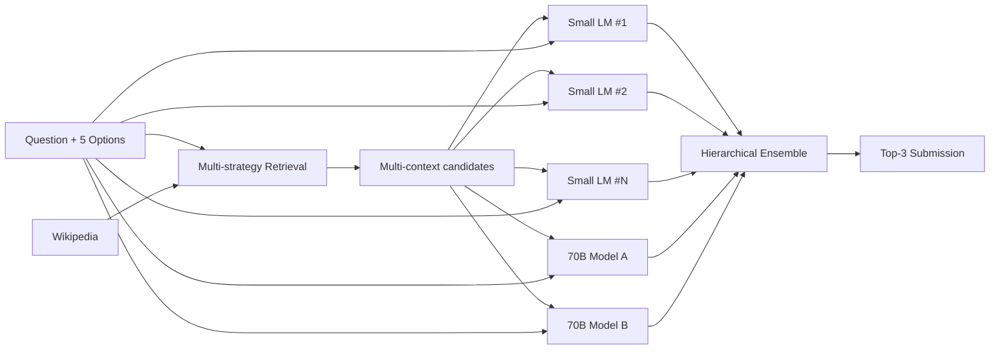

# 04. 3rd place — @podpall (huge pipeline with multiple LMs and dual 70B)

## 概要

「多モデル巨大パイプライン」型。Kaggle Notebook 制限内に **小規模 LM 多数 + 70B 2 個** を押し込んだ離れ業。

## アーキテクチャ

> 詳細な内部構造は writeup の核となる部分で、現状の二次情報からは完全な再構成は不能。

## 主要テクニック

- **大量の context 候補生成** (BM25 + dense + 別の retrieval method)
- **小規模 LM (DeBERTa など) で大量・低コスト推論** → 大部分の設問はここで決着
- **70B モデル 2 個を「難問」専用** に温存
- **9h Kaggle 制限**を満たすため、量子化 + 推論バッチ最適化が必須

## 使用モデル / データ

- 小規模: 複数（DeBERTa 系と思われる）
- 大規模: 70B クラス ×2 (Llama 2 70B / 別系統)
- 推論時は 4bit/8bit 量子化 + flash attention

## スコア

- Private LB: 0.92+ 帯（3 位）

## 独自の工夫

1. **小規模 + 大規模の段階的・選択的適用** — 全設問に 70B を当てるのは無理だが、難問だけならフィットする
2. **多モデルの統合**による分散低減

## 参考リンク

- [3rd place writeup (podpall)](https://www.kaggle.com/competitions/kaggle-llm-science-exam/writeups/podpall-3rd-place-solution-update-code-links)

## 2026 年視点での批評

- ✅ **今でも有効**: 「easy/hard 分岐 routing」は 2026 の adaptive inference / cascade serving の原型。LLM routing (RouteLLM, Martian) として研究領域化。
- ⚠️ **当時の制約**: 4bit Llama 2 70B は不安定で精度劣化が大きかった。Kaggle Notebook の T4 ×2 はメモリ厳しすぎた。
- 🔄 **現代の置き換え**:
  - Llama 2 70B → **DeepSeek V3 (671B MoE, active 37B)** や **Llama 4 Maverick (400B MoE)** — もはや 70B dense は中途半端
  - 量子化 → **AWQ / GPTQ / EXL2 + Marlin kernel** で精度損失を最小化
  - cascade routing → **uncertainty-based gating** (entropy threshold) で自動化可能
  - 小規模モデル → **Qwen 3 4B** が当時 Llama 2 70B と互角のベンチ多数
- 💡 **学べる教訓**: 「全設問に同じモデル」発想は時代遅れ。難易度ベースルーティングは 2026 のサービング設計でも標準。
