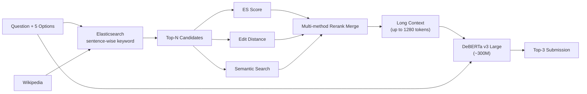

# 05. 4th place — Preferred Scantron (lightweight DeBERTa, no billion-param LM)

## 概要

**「DeBERTa v3 Large (300M) のみで 70B 級と渡り合う」** ことを実証したチーム。Elasticsearch + 多手法 rerank。

## アーキテクチャ

## 主要テクニック

- **Elasticsearch** で sentence 単位 keyword 検索
- **3 種類の rerank score** (ES, Edit distance, semantic) を統合
- **Token 長を 512 → 1280** に拡張するだけで Public LB が大きく改善
- **DeBERTa v3 Large のみ** — 重量級 LLM を使わない潔さ
- 追加データ: `@radek1` の question subset で fine-tune
- 検証として Llama 2 7B でゼロショット比較 (DeBERTa の優位を確認)

## 使用モデル / データ

- Retriever: Elasticsearch
- Scorer: DeBERTa v3 Large (300M)
- 追加データ: radek1 subset

## スコア

- Private LB: 0.92+ 帯（4 位）

## 独自の工夫

1. **モデル小型 × context 長最大化** という逆張り
2. Edit distance を rerank に組み込む（typo・固有名詞ゆれに強い）
3. **「巨大 LM 不要」を証明** したことが最大の貢献（再現容易性）

## 参考リンク

- [Preferred Scantron 4th place writeup (Kaggle Discussion)](https://www.kaggle.com/competitions/kaggle-llm-science-exam/discussion)

## 2026 年視点での批評

- ✅ **今でも有効**: 「context 長 >> モデルサイズ」の原則は 2026 でも生きる。特に MCQ や short-answer task では。Elasticsearch + 多重 rerank も再現性が高く、production 適性も高い。
- ⚠️ **当時の制約**: DeBERTa v3 の最大 context は 大きくても数 K まで。Token 1280 が当時の実用上限だった。
- 🔄 **現代の置き換え**:
  - DeBERTa v3 Large → **ModernBERT** (8K context, 2025) や **DeBERTa v4** (推測), **NV-Embed-v2 のエンコーダ部分**
  - Elasticsearch → そのまま使えるが **OpenSearch + neural retrieval plugin** か **Qdrant + ColBERT v2**
  - context 1280 → ModernBERT で **8K-32K context** が現実的
  - Llama 2 7B zero-shot 比較 → 2026 では Qwen 3 4B/8B zero-shot がベースライン
- 💡 **学べる教訓**: 「巨大モデル盲信」は誤り。タスク特化型の小モデル + 良い context の方が運用も精度も上回ることが多い。**2026 でも MCQ なら DeBERTa 系 + 良 context が依然 SOTA 級**。
