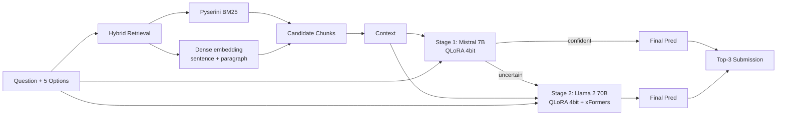

# 06. 5th place — Preferred おしゃべりんぼう (hybrid retrieval + 3-stage cascade)

## 概要

Sparse + Dense retrieval × 段階的推論（簡単→Mistral 7B、難問→Llama 2 70B）。

## アーキテクチャ

## 主要テクニック

- **Pyserini BM25 + dense embedding** の sparse/dense hybrid
- **3-stage 推論 cascade**:
  - 簡単な設問は Mistral 7B で即答
  - 難しい設問のみ Llama 2 70B に回す
  - （3 stage の中間は ensemble の合議制と推定）
- **QLoRA 4-bit + xFormers memory-efficient attention** で 70B を Kaggle T4×2 に押し込み
- **non-instruction-tuned base** を fine-tune（instruction-tuned より自由度高い）

## 使用モデル / データ

- Retriever: Pyserini (BM25) + dense embedding (詳細モデル名は writeup 参照)
- Scorer: Mistral 7B (QLoRA) + Llama 2 70B (QLoRA, non-instruct base)

## スコア

- Private LB: 0.92+ 帯（5 位）

## 独自の工夫

1. **3-stage cascade** — podpall に類似だが、stage 境界が明確
2. **non-instruction base** を選ぶ判断 — instruct fine-tune は MCQ にとってノイズになり得る
3. xFormers + QLoRA の組合せで 70B を Notebook 内に格納

## 参考リンク

- [Preferred おしゃべりんぼう 5th place writeup (Kaggle Discussion)](https://www.kaggle.com/competitions/kaggle-llm-science-exam/discussion)

## 2026 年視点での批評

- ✅ **今でも有効**: Cascade routing と「base モデルを fine-tune」戦略は 2026 でも有効。xFormers は Flash Attention 3 に置き換わり、QLoRA は unsloth 経由で 5x 高速化。
- ⚠️ **当時の制約**: Llama 2 70B / Mistral 7B は基準モデルとして古い。4bit QLoRA は精度劣化が無視できなかった。
- 🔄 **現代の置き換え**:
  - Mistral 7B + Llama 2 70B → **Qwen 3 4B (easy) + DeepSeek V3 / Llama 4 Maverick (hard)** — MoE で実効パラメータが小さい
  - Pyserini → そのまま使えるが、**Vespa / Qdrant** の方が production 向き
  - dense embedding → **BGE-M3 (multilingual) / NV-Embed-v2 (高精度)**
  - QLoRA → **DoRA / GaLore / PiSSA** で精度損失低減
  - cascade 判定 → **entropy / verbalized confidence** で自動化、または small router LM
- 💡 **学べる教訓**: Cascade はサービング時のコスト最適化として 2026 で完全に主流化。Kaggle で先取りしていた。
