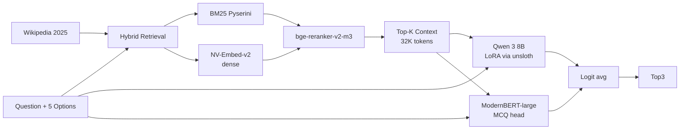

# 08. 2026 年 AI 視点での総合批評 — もし今これを解くなら

## 2023 年当時の前提と 2026 年の現実

| 要素 | 2023 年 (コンペ時) | 2026 年 |
|---|---|---|
| 最強 open LLM | Llama 2 70B / Falcon 180B | DeepSeek V3 (671B MoE) / Llama 4 Maverick 400B MoE / Qwen 3 235B MoE |
| 中規模で実用的 | Mistral 7B / Llama 2 13B | Qwen 3 8B / Llama 4 Scout 17B MoE / Phi-4 14B |
| Context 長 | DeBERTa 512〜1024 / Llama 2 4K | ModernBERT 8K / Llama 4 1M / Gemini 1.5 1-2M / Claude Opus 4.7 200K-1M |
| Embedding 最強 | BGE-large / e5-large | NV-Embed-v2 / BGE-M3 / Voyage-3 / text-embedding-3-large |
| Reranker | DeBERTa cross-encoder | bge-reranker-v2-m3 / Cohere Rerank 3 / Voyage rerank-2 |
| Fine-tune | LoRA / QLoRA (bnb) | unsloth (5x) / DoRA / GaLore / PiSSA / ORPO / KTO |
| 推論最適化 | xFormers / 量子化 4bit | vLLM / SGLang / TensorRT-LLM / AWQ+Marlin |
| 反応性能 | zero-shot は不安定 | Claude Opus 4.7 / GPT-5 / o3 が zero-shot で多くのベンチを破壊 |
| Reasoning | CoT prompting | o3 / Claude Opus 4 reasoning / DeepSeek R1 V2 など専用モード |

## 2026 年なら採るアプローチ（推奨度順）

### Tier 1: もし Kaggle Notebook 制限 (offline, T4×2, 9h) が同じなら

**推奨パイプライン** (offline 制約あり):



| 構成要素 | 採用理由 |
|---|---|
| BM25 + NV-Embed-v2 + bge-reranker | 2026 SOTA の retrieval スタック |
| ModernBERT-large (8K context) | 2023 の DeBERTa 後継。MCQ head が極めて強い、学習コスト極小 |
| Qwen 3 8B (LoRA via unsloth) | 当時の Mistral 7B より大幅に賢い、5x 速い学習 |
| データ生成 | Claude Opus 4.7 / GPT-5 で 100k+ high-quality synthetic |

### Tier 2: 制限が無い (API OK / 大規模 GPU) なら

**Claude Opus 4.7 / GPT-5 zero-shot** + **軽い検索** で 0.95+ MAP@3 が現実的。

```python
# 疑似コード
import anthropic
client = anthropic.Anthropic()
for q in test_questions:
    context = retrieve_wikipedia(q.prompt)  # 任意
    resp = client.messages.create(
        model="claude-opus-4-7",
        messages=[{
            "role": "user",
            "content": f"""You are a science exam expert. Read this Wikipedia context and rank the 5 options by likelihood of being correct.

Context: {context}

Question: {q.prompt}
A) {q.A}  B) {q.B}  C) {q.C}  D) {q.D}  E) {q.E}

Output the top 3 most likely answers, ranked from most to least likely, as just three letters separated by spaces (e.g. "A C B").""",
        }],
    )
    submission[q.id] = resp.content[0].text.strip()
```

API コスト概算: 4,000 設問 × ~2000 tokens in + 50 tokens out × Claude Opus 4.7 (推定 $15/M in + $75/M out) = $120 + $15 ≒ **$135 で全テスト推論完了**。1st place チームの GPU クラスター費用と比べれば桁違いに安い。

### Tier 3: 当時の上位陣手法 (2026 でも有効) ↔ 古い手法

| 2023 年の手法 | 2026 でも有効か | コメント |
|---|---|---|
| RAG (BM25 + dense + rerank) | ✅ 完全に有効 | むしろ embedding/reranker の進歩で精度向上 |
| DeBERTa v3 MCQ head | ✅ 後継として ModernBERT 推奨 | エンコーダ系は依然強い |
| LoRA fine-tune | ✅ unsloth / DoRA で 5x | 手法自体は普遍 |
| Llama 2 70B 4bit quantize | ⚠️ より良い量子化 + 新モデル | Llama 2 70B 自体は時代遅れ |
| 3-stage cascade routing | ✅ サービング技術として主流化 | 当時の先取り |
| GPT-3.5 で synthetic data 生成 | 🔄 GPT-5 / Claude 4.7 に置換 | 品質激変 |
| `past_key_values` cache | ✅ vLLM / SGLang で自動化 | 自前実装は不要に |
| xFormers attention | 🔄 Flash Attention 3 | 標準化された |
| Multi-class 5-way head | ✅ 有効 | 単純で速い |
| TF-IDF only baseline | ✅ 教育用に有用 | Cycle 01 で採用 |

## 本プロジェクトでの応用方針

1. **Cycle 01**: TF-IDF only（パイプライン確立、CV ロジック検証）
2. **Cycle 02**: Wikipedia RAG (BM25 + dense BGE-M3) を導入
3. **Cycle 03**: ModernBERT-large (8K) で MCQ head ファインチューン
4. **Cycle 04**: Qwen 3 8B (unsloth + LoRA) を追加、logit ensemble
5. **Cycle 05+**: Claude Opus 4.7 API zero-shot を比較対象として実行（Late Submission のため API 利用可）

## まとめ: 2026 年からのメッセージ

> 「**Retrieval 品質 × 良い小モデル × データ生成パイプライン**」が依然として勝ちパターン。
> 巨大モデル盲信ではなく、**タスク特化型小モデル + 強い context** の方が運用コストも精度も上回る。
> 一方で、**Claude Opus 4.7 / GPT-5 の zero-shot 性能**は無視できないベンチマークになっている。
