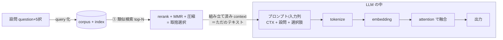

# 06 LLM は RAG をどう読み込むか — 注入の仕組み・フォーマット・取捨選択

> ⚠️ **本ファイルは Claude が Web 調査して作成**したメモ。`knowledge/search/` は通常ユーザー手動メモだが、本回はユーザー指示により Claude が代行。
>
> 元の発問:
> > LLM は RAG をどのように読み込む？ アーキテクチャ内の入力値とする？ RAG からの情報はコンテキストに変換する？ RAG はどのようなフォーマットだと LLM が読みやすい？ RAG には入力値に対して不要な情報が含まれており、どのように必要な情報を取捨選択している？ RAG と LLM の関係を図に示してほしい。
>
> 守備範囲: **取得した文書が「モデルに入る瞬間」のメカニズム**。検索の質を上げる話（embedder / reranker / chunk 戦略）は 01–05 が担当。本ファイルは *retrieval の出力 → LLM の入力* というインターフェースに絞る。
>
> 関連:
> - RAG が効く理由 → [`03_rag_why_it_works.md`](03_rag_why_it_works.md)
> - 作り方・5 原則（特に「minimum sufficient context」）→ [`04_rag_build_and_iterate.md`](04_rag_build_and_iterate.md) §2
> - 全体地図・派生形・失敗モード（reranker / Lost-in-the-Middle 等）→ [`05_rag_essential_knowledge_landscape.md`](05_rag_essential_knowledge_landscape.md) §3.4, §7
> - 本プロジェクトの注入方式 → [`../02/wikipedia_retrieval_plan.md`](../02/wikipedia_retrieval_plan.md) §5, [`../02/cycle02_4_model_plan.md`](../02/cycle02_4_model_plan.md) §0

最終更新: 2026-05-30

---

## §0. 結論先出し — 答えは「どの RAG か」で 2 通りに分かれる

「RAG」という語は **2 つの全く違う実装**を指す。LLM への入り方が根本的に違うので、まずこれを分ける。

| | **(I) in-context RAG（プロンプト注入型）** | **(II) アーキテクチャ融合型 RAG** |
|---|---|---|
| 別名 | prompt-stuffing, "open-book prompting" | retrieval-augmented architecture |
| 取得文書の入り方 | **ただのテキストとして入力プロンプトに連結**。モデル本体は無改造 | モデル内部の専用層（cross-attention 等）に**別経路で注入** |
| 代表例 | ChatGPT/Claude に context を貼る現代の RAG の大半、**本コンペの MCQ も実質これ** | 原典 RAG (Lewis 2020), FiD (Izacard&Grave 2020), RETRO (DeepMind 2021) |
| 学習の要否 | retriever も LLM も**触らなくて使える**（zero-shot 可） | retriever / generator を**専用に学習**する |
| 「コンテキストに変換」か | **YES** — 取得文 → トークン列 → 入力の一部 | 取得文は**入力プロンプトには入らず**、内部表現として融合 |

> 📌 **重要**: 2020 年の原典論文 (Lewis et al.) の "RAG" は (II) の **retriever+generator を一緒に学習して文書集合を marginalize する**仕組みであって、プロンプトに貼り付ける話ではない。「プロンプトに context を貼る = RAG」という用法は **ChatGPT 以降に広まった口語的な (I)**。両者を混同しないこと。
>
> 実務（および本コンペ）で 99% 使うのは **(I)**。以下、(I) を主軸に、(II) を対比として置く。

---

## §1. RAG と LLM の関係図（LLM 境界を明示）

最重要なのは「**どこからが LLM の中か**」という境界線。取捨選択（次節以降）は **ほぼ全部 LLM の外**で起きる。

```
══════════ LLM の外 (検索パイプライン: すべて "テキスト" のまま処理) ══════════ ║ ══ LLM の中 ══

 ┌─────────┐  ① 検索      ┌────────┐  ② 並べ替え  ┌────────┐  ③ 圧縮/間引き  ┌──────────┐ ║
 │ corpus  │ ──────────►  │ top-N  │ ──────────► │ rerank │ ──────────────► │ 組み立て  │ ║
 │ (Wiki)  │  embedding   │ chunks │  cross-enc  │ + MMR  │  truncate/      │ 済み      │ ║──┐
 │ + index │  類似検索     │ (粗い) │  で精選     │ dedup  │  compress       │ context   │ ║  │
 └─────────┘              └────────┘             └────────┘                 │ テキスト  │ ║  │ 文字列を
      ▲                                                                     └──────────┘ ║  │ 渡す
      │ 設問 (question + 5択) も同じ embedder で query 化 ──────────────────────┘           ║  ▼
      └──────────────────────────────────────────────────────────────────────────────────║ ┌─────────────┐
                                                                                          ║ │ tokenizer   │ 文字→token id
   ★ 取捨選択(①②③)は「モデルが1文字も見る前」に完了する                                    ║ │   ↓         │
     = LLM の外で、テキストを物理的に取捨選択している                                       ║ │ embedding層 │ token→ベクトル
                                                                                          ║ │   ↓         │
                                                                                          ║ │ attention   │ ← ここで初めて
                                                                                          ║ │ (自己/交差)  │   context と設問が
                                                                                          ║ │   ↓         │   "混ざる"
                                                                                          ║ │ 出力        │ MCQ: 5択スコア
                                                                                          ║ └─────────────┘   生成: 次token
```

mermaid 版（関係の要点だけ）:



→ **Q1（どう読み込む？）/ Q2（入力値か？）/ Q3（context に変換？）の答えは全部この境界線上にある**。(I) では取得文は「プロンプト＝入力値＝context」に変換されて入る。(II) では入力プロンプトには入らず、`attention` の手前で別経路から合流する。次節で 1 問ずつ。

---

## §2. Q1〈どう読み込む？〉/ Q2〈アーキテクチャの入力値か？〉

### (I) in-context RAG — 答え: **そう。ただの追加入力トークンとして読む**

取得した chunk テキストを、設問の前（または後ろ）に **文字列連結**するだけ。連結後の 1 本の文字列が tokenizer に渡り、通常の入力と全く同じ経路（token id → embedding → attention）を通る。**モデルのアーキテクチャは 1 ビットも変わらない**。

```
入力 = "[文脈] {retrieved_text}\n\n[質問] {question}\n[選択肢] {option}"
        └────────── これ全体が "1 つの入力列" として attention に入る ──────────┘
```

- モデルから見れば retrieved_text と question の区別は**位置と区切り記号だけ**。「ここからが根拠資料」とモデルが知るのは、後述のフォーマット（区切り）のおかげ。
- 自己注意 (self-attention) が「設問トークン ↔ 文脈トークン」の関連度を全ペアで計算し、設問に効く文脈トークンに重みを寄せる。これが「読んでいる」の実体。
- **学習は不要**。事前学習済み LLM はこの形をそのまま処理できる（少量 fine-tune でさらに上がる ＝ 本コンペがやること）。

### (II) アーキテクチャ融合型 — 答え: **入力プロンプトには入れない。内部に注入する**

「入力値か？」への答えが (I) と逆になるのがポイント。3 つの代表系統:

| 方式 | 取得文の入り方 | 一言 |
|---|---|---|
| **原典 RAG** (Lewis 2020, [2005.11401](https://arxiv.org/abs/2005.11401)) | 取得した各文書を 1 個ずつ generator の条件に与え、**文書集合について確率を周辺化 (marginalize)** して出力を決める（RAG-Sequence: 1 出力に 1 文書 / RAG-Token: token ごとに文書を混ぜる）。retriever と generator を**同時学習** | "どの文書で答えたか" を確率的に重み付け |
| **FiD** (Fusion-in-Decoder, Izacard&Grave 2020, [2007.01282](https://arxiv.org/abs/2007.01282)) | 各 passage を encoder で**別々に独立エンコード** → 全 passage の encoder 出力を**連結** → decoder が cross-attention で一括参照（=Fusion in Decoder）。passage 数を増やすほど精度↑ | 多数文書の証拠統合に強い |
| **RETRO** (DeepMind 2021, [2112.04426](https://arxiv.org/abs/2112.04426)) | 入力を chunk に割り、近傍文書を frozen BERT で取得 → **chunked cross-attention** 専用ブロック（9 層目以降の 3 層ごと）で本流に融合 | 25× 小さいモデルで GPT-3 級 |

→ いずれも取得文は **「プロンプト文字列」ではなく、cross-attention の key/value 側に別経路で入る**。だから (II) では Q2 の答えは「主入力ストリームの入力値ではない」。

> 📌 本コンペ（と現代の実務 RAG の大半）は **(I)**。(II) は「RAG を学習で内蔵する」より高度な系統で、知識として押さえておけば十分。05 §6 の派生形（Self-RAG/CRAG/GraphRAG…）は (I) の上流を賢くする話で、(II) のアーキ改造とはまた別軸。

---

## §3. Q3〈RAG からの情報はコンテキストに変換する？〉

**(I) では YES、そして "context = 重みに焼かない記憶" であることが本質**。

- 取得文は **モデルの重み（パラメータ）には一切書き込まれない**。テキスト → token id → embedding ベクトル列、という**揮発的な入力表現**に変換され、その推論 1 回かぎりで使われて消える。
- これが [`05_…landscape.md`](05_rag_essential_knowledge_landscape.md) §1.1 / [`03_rag_why_it_works.md`](03_rag_why_it_works.md) のいう **non-parametric memory（非パラメトリック記憶）**。
  - **parametric memory** = 事前学習で重みに焼き込んだ知識（暗記。更新には再学習が要る）
  - **non-parametric memory** = 今この推論用に外から渡す context（参照。差し替え自由、学習不要）
- だから RAG は「知識を覚え直す」のではなく「**毎回、必要な参考書のページを開いて渡す**」操作。context window（入力トークンの上限）に収まる範囲しか一度に渡せない、という物理制約が直接ここから来る（→ §5 の取捨選択が必要な根本理由）。

> (II) の RETRO/FiD では「context window に貼る」のではなく内部表現に融合するので、巨大な corpus を context 長の制約なしに参照できるのが利点。ただし実装・学習コストが高い。

---

## §4. Q4〈どんなフォーマットだと LLM が読みやすい？〉

(I) では「フォーマット ＝ モデルへの唯一の道しるべ」なので効く。Web の実務知見をまとめると 5 点:

1. **明示的な区切り (delimiter) で context と設問を分ける**（最重要）。区切りが無いと「どこが資料でどこが質問か」が判別できず、**モデルが context を無視する**事故が起きる。`[CONTEXT] … [QUESTION] …` や XML タグ `<doc>…</doc>` 等。
2. **構造化タグ（XML 風）が読みやすい**。現代 LLM は事前学習で大量の XML/HTML を見ているので `<document id=1 source="...">…</document>` 形式を自然に解釈できる。複数文書を渡すなら 1 文書 1 ブロックで**毎回同じ構造**にする（一貫性がエラーを減らす）。
3. **メタデータ（出典・日付・relevance score）をタグ属性で添える**と、モデルが「どの資料が信頼できるか」を判断でき、デバッグ時に「高 relevance 資料を優先できているか」を検証できる。
4. **順序が効く（Lost-in-the-Middle）**: LLM は **入力の先頭と末尾に注意が偏り、中央を取りこぼす** U 字特性がある（[`05_…`](05_rag_essential_knowledge_landscape.md) §7.1, Liu et al. 2024）。→ **最重要 chunk を先頭か末尾**に置く。
5. **minimum sufficient（必要十分の最短）**: 長く詰めるほど精度が落ちる（[`05_…`](05_rag_essential_knowledge_landscape.md) §7.2, [`04_…`](04_rag_build_and_iterate.md) 原則3）。短く絞ってから渡す。

### 本コンペ MCQ の具体フォーマット（採用）

[`../02/wikipedia_retrieval_plan.md`](../02/wikipedia_retrieval_plan.md) §5 の prefix concat:

```
[CTX] {top5_chunks_concat}

[QUESTION] {question}
[CHOICE] {option_i}      ← i = A..E、5 本作って 5 スコアを softmax
```

- `[CTX]` / `[QUESTION]` / `[CHOICE]` の区切りトークンが上記 (1) の役割。
- max_length=512 が (5) の「短く絞る」を物理的に担保（context が溢れたら truncation で末尾を捨てる）。

---

## §5. Q5〈不要情報をどう取捨選択する？〉— **2 つの層に分けて理解する**

RAG の入力には確かにノイズ（無関係 chunk・矛盾文書）が混ざる。「どう必要分を選ぶか」の答えは **「モデルの外」と「モデルの中」で別物**。ここを混同すると誤解する。

### 層 A: LLM の外（検索パイプライン）— **物理的にテキストを捨てる**

モデルが 1 文字も見る前に、漏斗 (funnel) で削る。これが取捨選択の主役:

| 段 | 手法 | 役割 | 参照 |
|---|---|---|---|
| ① retrieve | embedding 類似検索 / BM25 で **top-N**（N=20〜100 等、多め） | **recall 優先**（取りこぼさない） | [`05_…`](05_rag_essential_knowledge_landscape.md) §3 |
| ② rerank | **cross-encoder** で (query, chunk) を精密に再採点 → 上位だけ残す | **precision 優先**（ノイズ除去） | [`05_…`](05_rag_essential_knowledge_landscape.md) §3.4 |
| ③ 多様化 | **MMR** (Maximal Marginal Relevance): 「query への近さ」と「既選択との重複の少なさ」を両立 → 重複・冗長を除く | dedup / 多様性 | — |
| ④ 圧縮 | **context compression**（例: LLMLingua = 小型 LLM が perplexity で不要トークンを枝刈り、2〜5× 圧縮）/ 文書まるごと filter | context 長を節約 | — |
| ⑤ truncate | 残りを context window 予算に合わせて切る + 順序付け（§4-4） | 予算厳守 | — |

> 📌 **bi-encoder vs cross-encoder の役割分担**（[`05_…`](05_rag_essential_knowledge_landscape.md) §1.3）が選別の肝: ①は速いが粗い bi-encoder で広く拾い、②は遅いが精密な cross-encoder で絞る。「上流で recall、下流で precision」（[`04_…`](04_rag_build_and_iterate.md) 原則1）。

### 層 B: LLM の中（attention）— **捨てない。"弱く重み付け"するだけ**

- 渡された context のうち不要なトークンを、モデルは**削除できない**。self-attention が関連度の低いトークンに**小さい注意重みを割り当てる（soft weighting）**だけ。
- だから不要情報が多いと、重みが完全には 0 にならず **distraction（気の散り）で誤答する**ことがある（[`05_…`](05_rag_essential_knowledge_landscape.md) §7.3。NoisyBench で最大 80% 低下の報告）。
- **結論**: モデル内部の soft weighting は当てにならない → だからこそ **層 A でハードに捨てておく**必要がある。「取捨選択」の実体は層 A。

---

## §6. 本コンペへの当てはめ（誤解防止）

> ⚠️ **本コンペの DeBERTa-v3 は "生成 LLM" ではない**。ここを取り違えやすい。

- 本コンペの backbone（[`../01/cycle01_1_models_overview.md`](../01/cycle01_1_models_overview.md)）は **encoder 型 DeBERTa + MCQ head ＝ 系列分類器**。トークンを生成しない。
- 流れ: `[CTX]+設問+選択肢` を **1 本の入力列**に連結 → encoder の **self-attention で文脈・設問・選択肢を混ぜる** → `[CLS] 相当の表現をスコア化` → 5 択を softmax。
  - これは FiD/RETRO のような「生成 decoder への融合」ではなく、**cross-encoder 的な "読んで分類"**（§1 (I) の最も素直な形）。
- つまり本コンペの RAG は **「(I) in-context を、生成ではなく分類ヘッドで受ける」**形。Q1–Q5 の答えは全部 (I) 側で読めばよい:
  - 読み込み方 = 入力列に連結（§2-I）／ context に変換 = YES, 非パラメトリック（§3）／ フォーマット = `[CTX][QUESTION][CHOICE]` + 短く（§4）／ 取捨選択 = 層 A（retrieve→rerank→top-5→max_len 512 で truncate）が主役（§5-A）。

---

## §7. 一行まとめ

- **(I) in-context RAG（実務・本コンペ）**: 取得文は **ただのテキストとして入力に連結 → context に変換 → 通常の attention で読む**。モデルは無改造。
- **(II) 融合型 RAG（原典/FiD/RETRO）**: 取得文は **入力に貼らず、cross-attention 等で内部に注入**。retriever ごと学習する。
- **フォーマット**: 区切り明示・構造化（XML 風）・重要分を端に・短く（minimum sufficient）。
- **取捨選択**: **モデルの外**（retrieve→rerank→MMR→圧縮→truncate）でハードに捨てるのが本体。モデル内 attention は soft-weighting しかせず、ノイズに気を散らすので外で削る。
- **本コンペ**: DeBERTa は**生成でなく分類**。(I) を MCQ ヘッドで受ける形。

---

## 出典（信頼度ランク）

**Tier 1（一次論文）**
- [Lewis et al. 2020 — Retrieval-Augmented Generation for Knowledge-Intensive NLP Tasks (arXiv 2005.11401)](https://arxiv.org/abs/2005.11401) — 原典 RAG、RAG-Sequence/Token と marginalization
- [Izacard & Grave 2020 — Leveraging Passage Retrieval with Generative Models for Open Domain QA / FiD (arXiv 2007.01282)](https://arxiv.org/abs/2007.01282) — Fusion-in-Decoder
- [Borgeaud et al. 2021 — Improving LMs by retrieving from trillions of tokens / RETRO (arXiv 2112.04426)](https://arxiv.org/abs/2112.04426) — chunked cross-attention
- [Liu et al. 2024 — Lost in the Middle (TACL)](https://aclanthology.org/2024.tacl-1.9.pdf) — 順序効果（§4-4, 既出 05 §7.1）

**Tier 2（解説ブログ・実務ガイド）**
- [The Illustrated Retrieval Transformer (jalammar)](https://jalammar.github.io/illustrated-retrieval-transformer/) — RETRO の図解
- [RAG Prompt Engineering: Context Placement & Citation (Brenndoerfer)](https://mbrenndoerfer.com/writing/rag-prompt-engineering-context-citations) — 区切り・XML・メタデータ（§4）
- [RAG Context Assembly: Top-K, Dedupe, Citations (Petrusenko)](https://www.maxpetrusenko.com/blog/rag-context-assembly-topk-dedupe-and-citations) — 組み立て段の取捨選択（§5-A）
- [LongLLMLingua Prompt Compression (LlamaIndex)](https://www.llamaindex.ai/blog/longllmlingua-bye-bye-to-middle-loss-and-save-on-your-rag-costs-via-prompt-compression-54b559b9ddf7) — context 圧縮（§5-A ④）
- [Fusion-in-Decoder (EmergentMind)](https://www.emergentmind.com/topics/fusion-in-decoder-fid) — FiD の挙動整理

**プロジェクト内参照**
- [`05_rag_essential_knowledge_landscape.md`](05_rag_essential_knowledge_landscape.md) §1.1/§1.3/§3.4/§6/§7 — 用語・reranker・派生形・失敗モード
- [`04_rag_build_and_iterate.md`](04_rag_build_and_iterate.md) §2 — 5 原則（recall/precision, minimum sufficient）
- [`03_rag_why_it_works.md`](03_rag_why_it_works.md) — parametric vs non-parametric の因果
