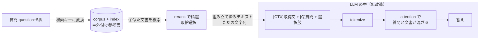

# 07 RAG と LLM の関係 — 図で分かる初心者ガイド

> ⚠️ **本ファイルは Claude が作成**したメモ。`knowledge/search/` は通常ユーザー手動メモだが、05/06 と同様、本回はユーザー指示により Claude が代行。
>
> 元の発問:「RAG と LLM の関係を**図を重点的に**記載して。**LLM 初心者にも分かるように**まとめてほしい。」
>
> 守備範囲: **RAG と LLM の関係を "図" で一望する初心者向け入口**。詳しい理屈・数式・派生形は既存の専門メモ（下記）に委譲し、本ファイルは**絵で理解する**ことに全振りする。
>
> 姉妹ファイル: アンサンブル（複数モデルの束ね方）は [`08_rag_ensemble_design_and_selection.md`](08_rag_ensemble_design_and_selection.md)。

最終更新: 2026-05-30

---

## 📖 読む順番（このテーマの学習ルート）

初心者がこのテーマを最短で理解するための推奨順序。**本ファイル（07）が入口**で、そこから深掘りに枝分かれする。

```
   ① 07 本ファイル（図でRAG×LLMの全体像をつかむ）   ← イマココ
        │
        ├─►② 06_how_llm_consumes_rag.md      （LLMへの「入り方」を厳密に）
        │
        ├─►③ 05_rag_essential_knowledge_landscape.md（RAGの種類・用語・失敗モードの辞書）
        │
        ├─►④ 03_rag_why_it_works.md          （なぜ効くのかの理屈）
        │
        └─►⑤ 04_rag_build_and_iterate.md     （実際の作り方・改善の回し方）

   ⑥ アンサンブルへ進むなら → 08_rag_ensemble_design_and_selection.md
```

| 順 | ファイル | 一言 | レベル |
|---|---|---|---|
| ① | **07（本ファイル）** | 図でRAG×LLMの全体像 | 入門 |
| ② | [`06_how_llm_consumes_rag.md`](06_how_llm_consumes_rag.md) | LLMが取得文を読む仕組みを厳密に | 中級 |
| ③ | [`05_rag_essential_knowledge_landscape.md`](05_rag_essential_knowledge_landscape.md) | RAG全体地図・種類・用語集 | 中級（辞書） |
| ④ | [`03_rag_why_it_works.md`](03_rag_why_it_works.md) | RAGがなぜ効くか | 中級 |
| ⑤ | [`04_rag_build_and_iterate.md`](04_rag_build_and_iterate.md) | 作り方・改善のイテレーション | 実践 |
| ⑥ | [`08_rag_ensemble_design_and_selection.md`](08_rag_ensemble_design_and_selection.md) | 複数モデルの束ね方・選定基準 | 応用 |

---

## §1. 一言でいうと — RAG は LLM の「外付け参考書」

まず比喩で。

- **LLM**（大規模言語モデル）= 膨大な文章で訓練し、知識を**頭（重み）に丸暗記**した人。賢いが、**暗記していないこと・新しいこと・細かい数値**はうろ覚えで間違える（=ハルシネーション）。
- **RAG**（Retrieval-Augmented Generation = 検索拡張生成）= その人に、**毎回その場で必要な参考書のページを開いて手渡す**仕組み。試験を「暗記だけで解く（closed-book）」から「**参考書持ち込み可（open-book）**」に変える。

```
  ┌─────────────┐                       ┌─────────────┐
  │   LLM       │   "覚えてないことは    │   LLM       │  "参考書見ながら
  │ （暗記だけ） │    うろ覚えで誤答"      │ ＋ RAG      │   なら正答できる"
  │             │   ──────────────►     │（参考書持込）│
  │  📖頭の中    │     ❌ 1898年? 1903年? │  📖+📄外部文書│   ✅ 1898年!
  └─────────────┘                       └─────────────┘
     closed-book                            open-book
```

> 📌 本プロジェクト（Kaggle LLM Science Exam）はまさにこれ。Cycle 01 は「暗記だけ（closed-book）」で Public 0.68。Cycle 02 で**参考書（Wikipedia retrieval）を渡して open-book 化**し、上限を引き上げるのが狙い（[`../02/cycle02_4_model_plan.md`](../02/cycle02_4_model_plan.md)）。

---

## §2. 全体像の図 — RAG と LLM はどこで繋がるか

**いちばん大事な一枚**。RAG は「LLM の外側にある検索パイプライン」で、最後に**テキストを LLM に手渡す**だけ。LLM 本体は何も改造しない。

```
 ═══════════════ LLM の「外」（検索パイプライン）═══════════════ ║ ═══ LLM の「中」 ═══
                                                                ║
  ┌──────────┐                                                  ║
  │ corpus   │  たくさんの文書（例: Wikipedia 全記事）           ║
  │ (Wiki)   │                                                  ║
  └────┬─────┘                                                  ║
       │ ①事前に小さく切る(chunk)＋ベクトル化して索引(index)化   ║
       ▼                                                        ║
  ┌──────────┐    ②質問が来たら            ┌──────────┐         ║   ┌──────────────┐
  │ index    │◄───似た文書を検索───────────│ 質問      │         ║   │  LLM 本体     │
  │(FAISS等) │    （top-N を取得）          │ question  │         ║   │              │
  └────┬─────┘                             │ +選択肢   │         ║   │ ・tokenize   │
       │ ③並べ替え(rerank)＋不要分を捨てる                       ║   │ ・attention  │
       ▼                                                        ║   │   で質問と    │
  ┌──────────────────────────┐  ④「質問＋取得文」を            ║   │   文書が混ざる │
  │ 組み立て済みテキスト       │     1本の文字列に組み立てて      ─────►│ ・答えを出す  │
  │ [CTX]取得文 [Q]質問 [選択肢]│     LLM に渡す（＝入力）         ║   │  (MCQ: 5択)  │
  └──────────────────────────┘                                  ║   └──────────────┘
                                                                ║
  ★ 取捨選択（①②③）は「LLMが1文字も見る前」に終わっている        ║   ★ LLMはただ
    = 不要文書を物理的に捨てるのは "LLMの外"                       ║     "読んで答える"だけ
```

mermaid 版（関係の骨だけ）:



**この図の3つのポイント**（初心者がまず押さえる点）:

1. **RAG は LLM の外。** 検索・並べ替え・取捨選択は、LLM が動く前に終わっている。
2. **繋ぎ目は "テキスト"。** RAG が最後に作るのは特別なデータではなく、**ただの文字列**。それを LLM の入力にくっつけるだけ。
3. **LLM は無改造。** モデルの中身はいじらない。普通の入力として読むだけ。

→ もっと厳密な「中と外の境界」は [`06_how_llm_consumes_rag.md`](06_how_llm_consumes_rag.md) §1。

---

## §3. 図解1 — closed-book vs open-book（RAG の有無で何が変わるか）

LLM 単体と、RAG を足した時の**入力の違い**を並べる。

```
【RAGなし: closed-book】 LLMは頭の暗記だけで解く
 ┌────────────────────────────────────────┐
 │ 入力: [Q] ラジウムは何年に発見された？    │
 │       [選択肢] 1898 / 1903 / 1911 ...    │
 └────────────────────────────────────────┘
            │ 暗記が曖昧だと…
            ▼  ❌ 自信なく誤答しやすい（特に年代・固有名詞・数値）


【RAGあり: open-book】 取得文を頭に貼ってから解く
 ┌──────────────────────────────────────────────────────────┐
 │ 入力: [CTX] Radium was discovered in 1898 by Marie and     │ ← 検索で
 │            Pierre Curie ... a radioactive alkaline earth..│   引いてきた
 │       [Q] ラジウムは何年に発見された？                      │   Wikipedia文
 │       [選択肢] 1898 / 1903 / 1911 ...                      │
 └──────────────────────────────────────────────────────────┘
            │ 答えが文中にある！
            ▼  ✅ 正答しやすい（参考書を見て答える状態）
```

> 📌 本コンペで「効果を正しく測る」には、この **(a) RAGあり と (b) RAGなし を両方提出して差（Δ）を見る**のが鉄則（ablation）。詳細は [`../02/cycle02_4_model_plan.md`](../02/cycle02_4_model_plan.md) §0。

---

## §4. 図解2 — RAG パイプラインの「部品」全体図

§2 を部品ごとに分解。**オフライン（事前に1回）** と **オンライン（質問のたび）** に分かれるのが肝。

```
┌──── オフライン（事前に1回だけ。重い処理はここで済ます）────────────────┐
│                                                                          │
│  Wikipedia   ──►  chunk分割  ──►  embedder  ──►  ベクトル ──►  index構築  │
│  （corpus）       長文を90語     文章を意味の    各chunk=     FAISS等で    │
│                   程度に刻む     ベクトルに変換   1ベクトル    検索可能に   │
│                                                                          │
└──────────────────────────────────────────────────────────────────────────┘
                                                          ▲
                                                          │ 似たベクトルを探す
┌──── オンライン（質問が来るたび）──────────────────────────┼──────────────┐
│                                                          │              │
│ 質問+選択肢 ──► 同じembedderで ──► index検索 ──► top-N ──► rerank ──► top-k │
│               ベクトル化(query)    （粗く多め）  候補     （精選）   厳選   │
│                                                                    │     │
│                                  組み立て: [CTX]+[Q]+[選択肢] ◄─────┘     │
│                                            │                             │
│                                            ▼                             │
│                                       LLM が読んで答える                  │
└──────────────────────────────────────────────────────────────────────────┘
```

### 各部品が何をするか（初心者向けの1行説明）

| 部品 | 役割（比喩） | 本コンペでの採用 |
|---|---|---|
| **chunk 分割** | 参考書を「引きやすいページ単位」に切る | 90 word + 3 sentence overlap |
| **embedder（埋め込み）** | 文章を「意味が近いと近くなる数字の列（ベクトル）」に変換する翻訳機 | `BAAI/bge-base-en-v1.5` |
| **index（索引）** | 数百万ページから「似たページ」を一瞬で探す検索台帳 | FAISS `IndexFlatIP` |
| **retrieve（検索）** | 質問に似たページを top-N 引く（取りこぼさないよう多め） | top-5 |
| **rerank（並べ替え）** | 引いたページを精密に採点し直し、本当に効くものだけ残す | Cycle 02 v2 で追加予定 |
| **inject（注入）** | 厳選ページを質問の前に貼って LLM に渡す | `[CTX]…[Q]…[選択肢]` |

> 各部品の選択肢の比較（chunk 戦略6種、embedder の選び方、index の種類）は [`05_rag_essential_knowledge_landscape.md`](05_rag_essential_knowledge_landscape.md) §2・§3、本コンペでの具体設計は [`../02/wikipedia_retrieval_plan.md`](../02/wikipedia_retrieval_plan.md)。

---

## §5. 図解3 — LLM の「中と外」の境界（取捨選択はどこで起きる？）

初心者が**最も誤解しやすい点**: 「LLM が賢いから不要文書を無視してくれる」── これは**半分しか正しくない**。取捨選択は主に **LLM の外** で物理的にやる。

```
            LLM の「外」                    ║          LLM の「中」
  ─────────────────────────────────────── ║ ───────────────────────────
                                          ║
  取得した文書（玉石混交）                  ║   渡された文書は
   📄当たり 📄当たり 📄ハズレ 📄ハズレ      ║   もう "削れない"
        │                                 ║        │
        ▼ ①検索: 多めに拾う(recall優先)    ║        ▼
        ▼ ②rerank: 精密採点でハズレを捨てる ║   attention が
        ▼ ③MMR: 重複・冗長を捨てる          ║   「効く文書に強い注意、
        ▼ ④圧縮/truncate: 長さを予算内に     ║    効かない文書に弱い注意」
        │                                 ║   を割り振るだけ
   📄当たり 📄当たり  ← ハードに捨てた後      ║   （= soft weighting。
        │                                 ║      0 にはできない）
        └────────── LLM に渡す ──────────► ║   ⚠️ ハズレが多いと
                                          ║      気が散って誤答(distraction)
  ★ "本当の取捨選択" はこの外側で完了する     ║   ★ だから外で削っておく
```

**結論（重要）**:

- **LLM の外**（検索→rerank→MMR→圧縮）で、**不要文書を物理的に捨てる**のが取捨選択の本体。
- **LLM の中**（attention）は、不要文書を**削除できず**、弱い注意を割り当てるだけ。ノイズが多いと「気が散って」精度が落ちる（NoisyBench で最大80%低下の報告あり）。
- だからこそ「外でしっかり捨ててから渡す」ことが効く。

→ この層 A（外）／層 B（中）の分け方の厳密版は [`06_how_llm_consumes_rag.md`](06_how_llm_consumes_rag.md) §5。失敗モード（Lost in the Middle 等）は [`05_…`](05_rag_essential_knowledge_landscape.md) §7。

---

## §6. 図解4 — LLM に渡す「入力フォーマット」（読みやすい形）

RAG が最後に作る文字列は、**区切り記号で「ここが資料／ここが質問」を明示**すると LLM が読み違えない。

```
 ┌─────────────────────────────────────────────┐
 │ [CTX]   ← ここからが取得した参考文書          │  ← 区切り(delimiter)が
 │  Radium was discovered in 1898 by ...        │     「道しるべ」
 │  （top-5 chunk を連結）                       │
 │                                              │
 │ [QUESTION]  ← ここからが質問                  │
 │  In what year was radium discovered?         │
 │                                              │
 │ [CHOICE]  ← 選択肢（A〜E を1本ずつ、5本作る）  │
 │  1898                                        │
 └─────────────────────────────────────────────┘
        │ これを選択肢5本ぶん作って
        ▼ それぞれスコア化 → softmax → top-3 を提出
```

**読みやすいフォーマットの4原則**（初心者がまず守る点）:

1. **区切りを明示**（`[CTX]` `[QUESTION]` 等）── 無いと「どこが資料か」分からず資料を無視する事故が起きる。
2. **重要な文書を端（先頭か末尾）に**置く ── LLM は真ん中を取りこぼす（Lost in the Middle）。
3. **短く絞る**（minimum sufficient）── 長く詰めるほど精度が落ちる。
4. **毎回同じ構造**にする ── 一貫性がミスを減らす（複数文書なら XML 風 `<doc>…</doc>` も有効）。

→ フォーマットの詳細・出典は [`06_how_llm_consumes_rag.md`](06_how_llm_consumes_rag.md) §4。

---

## §7. 一言まとめ（この1枚だけ覚えるなら）

```
 RAG = LLM の「外付け参考書」システム。
   ・LLM 本体は無改造。繋ぎ目は "ただのテキスト"。
   ・取捨選択（不要文書を捨てる）は LLM の "外" でやるのが本体。
   ・LLM の "中" の注意は弱く重み付けするだけ → 外で削るのが効く。
   ・入力は「区切り明示・重要分を端・短く」が読みやすい。
   ・本コンペ: closed-book(Cycle01) → open-book(Cycle02 retrieval) で上限を上げる。
```

**次に読むなら**:
- 仕組みを厳密に → [`06_how_llm_consumes_rag.md`](06_how_llm_consumes_rag.md)
- RAG の種類・用語を網羅 → [`05_rag_essential_knowledge_landscape.md`](05_rag_essential_knowledge_landscape.md)
- **複数モデルを束ねる（アンサンブル）** → [`08_rag_ensemble_design_and_selection.md`](08_rag_ensemble_design_and_selection.md)

---

## 関連 / 出典

**プロジェクト内（このテーマの土台）**
- [`05_rag_essential_knowledge_landscape.md`](05_rag_essential_knowledge_landscape.md) — RAG 全体地図・種類・失敗モード・用語集
- [`06_how_llm_consumes_rag.md`](06_how_llm_consumes_rag.md) — LLM への注入の仕組み（本ファイルの厳密版）
- [`03_rag_why_it_works.md`](03_rag_why_it_works.md) / [`04_rag_build_and_iterate.md`](04_rag_build_and_iterate.md) — 理屈と作り方
- [`08_rag_ensemble_design_and_selection.md`](08_rag_ensemble_design_and_selection.md) — アンサンブル（姉妹ファイル）
- [`../02/cycle02_4_model_plan.md`](../02/cycle02_4_model_plan.md) / [`../02/wikipedia_retrieval_plan.md`](../02/wikipedia_retrieval_plan.md) — 本コンペでの具体設計

**主要一次文献（図の背景）**
- Lewis et al. 2020 — Retrieval-Augmented Generation ([arXiv 2005.11401](https://arxiv.org/abs/2005.11401))
- Liu et al. 2024 — Lost in the Middle ([TACL](https://aclanthology.org/2024.tacl-1.9.pdf))
</content>
</invoke>
