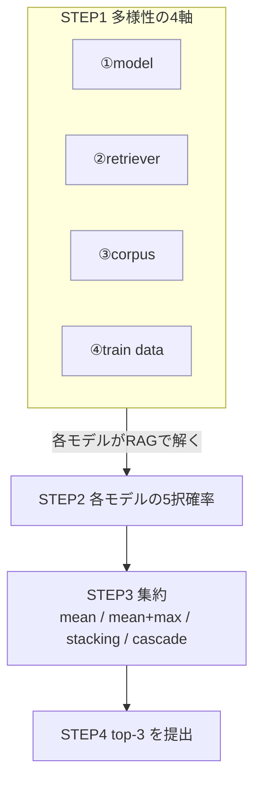

# 08 RAG 付き複数 LLM のアンサンブル設計と、モデル選定基準

> ⚠️ **本ファイルは Claude が作成**したメモ。`knowledge/search/` は通常ユーザー手動メモだが、05/06/07 と同様、本回はユーザー指示により Claude が代行。
>
> 元の発問:「RAG と LLM のアンサンブルモデルの**設計方法**と、LLM のアンサンブル学習に用いる**モデルの選定基準**についてまとめてほしい。**初心者にも分かるように**、**アカデミックな調査**を加味して。」
>
> 守備範囲: **「RAG を組み込んだ複数 LLM の出力を束ねる（アンサンブルする）」設計と、何を束ねるか（モデル選定基準）**。アンサンブルの起源・学術妥当性・上位陣の実装詳細は既存 [`00_ensemble_pipeline_origin_validity.md`](00_ensemble_pipeline_origin_validity.md) が土台。本ファイルはそれを **初心者向けに図で再構成 + 2025 年時点のアカデミック分類を追加**する。
>
> 姉妹ファイル: RAG と LLM の関係そのもの（図入門）は [`07_rag_llm_relationship_for_beginners.md`](07_rag_llm_relationship_for_beginners.md)。

最終更新: 2026-05-30

---

## 📖 読む順番（このテーマの学習ルート）

```
   ① 07_rag_llm_relationship_for_beginners.md （まずRAG×LLMの全体像を図で）
        │
        ▼
   ② 08 本ファイル（アンサンブルの設計と選定基準）   ← イマココ
        │
        ├─►③ 00_ensemble_pipeline_origin_validity.md（起源・学術妥当性・上位陣の実装＋Q&A）
        │
        └─►④ ../01/ensemble_methods.md          （本コンペの実装: TTA + mean+max）
```

| 順 | ファイル | 一言 |
|---|---|---|
| ① | [`07_…relationship_for_beginners.md`](07_rag_llm_relationship_for_beginners.md) | RAG×LLMの全体像（図入門） |
| ② | **08（本ファイル）** | アンサンブル設計＋選定基準（初心者向け＋最新分類） |
| ③ | [`00_ensemble_pipeline_origin_validity.md`](00_ensemble_pipeline_origin_validity.md) | 起源・学術妥当性・上位陣実装・回帰/LLM平均Q&A（**深掘りの本体**） |
| ④ | [`../01/ensemble_methods.md`](../01/ensemble_methods.md) | 本コンペ実装（TTA + mean+max） |

---

## §1. アンサンブルとは — なぜ「複数モデルの平均」が1個より強いのか

**アンサンブル = 複数のモデルの答えを合わせて1つの最終回答にする**こと。古典的（1990 年代〜）かつ学術的に完全に正統な手法（[`00_…`](00_ensemble_pipeline_origin_validity.md) Q2）。

### なぜ効く？ — 「違う間違い方をするモデル」を混ぜると誤りが相殺する

```
  モデルA  ✅✅❌✅❌✅   ← Aは問3,5で誤答
  モデルB  ✅❌✅✅✅❌   ← Bは問2,6で誤答     ← 違う問題で間違える！
  モデルC  ❌✅✅✅❌✅   ← Cは問1,5で誤答
  ───────────────────
  多数決/平均 ✅✅✅✅?✅  ← 各問「多数派」が勝ち、個々の誤りが打ち消される
                  ↑問5はA・Cが誤答で割れる（=苦手が重なると効果は薄い）
```

**ポイント（初心者が押さえる1点）**:
> アンサンブルが効くのは「モデルが**違う種類の誤り**をする」とき。全員が同じ問題で間違える（誤りが相関する）と、いくら足しても改善しない。
> → だから設計の核心は「**正確さ**」より「**多様性（diversity）**」。これは bias-variance 分解で「diversity は隠れた次元」と理論化されている（Wood et al. 2023, [arXiv 2301.03962](https://arxiv.org/abs/2301.03962)）。

理論的な3つの理由（Dietterich 2000）と bias-variance の詳細は [`00_…`](00_ensemble_pipeline_origin_validity.md) Q1。

---

## §2. RAG 付き複数 LLM のアンサンブル — 全体設計図

本コンペ（MCQ＝5択 + 確率出力）での標準形。**「多様性を作る → 各モデルの確率を出す → 集約する → top-3 を提出」** の4段。

```
┌─ STEP1: 多様性を「4つの軸」で作る ───────────────────────────────────┐
│                                                                      │
│  ① モデル本体     DeBERTa-v3 / Mistral / Llama … （暗記の癖が違う）   │
│  ② Retriever     BM25(語の一致) / e5・bge(意味の近さ)（引く文書が違う）│
│  ③ コーパス       Wiki 2023-06 / 2023-07 / cirrussearch（資料源が違う）│
│  ④ 訓練データ     radek6.5k / MMLU / 自家生成（学習の偏りが違う）      │
│                                                                      │
│   → 1軸でなく複数軸を同時に揺らす（=誤りが相関しにくくなる）           │
└──────────────────────────────────────────────────────────────────────┘
                              │ それぞれが RAG で文書を引いて解く
                              ▼
┌─ STEP2: 各モデルが「5択の確率」を出す ──────────────────────────────┐
│   モデルA → [A:0.6 B:0.1 C:0.2 D:0.05 E:0.05]                        │
│   モデルB → [A:0.5 B:0.2 C:0.2 D:0.05 E:0.05]                        │
│   モデルC → [A:0.7 B:0.1 C:0.1 D:0.05 E:0.05]                        │
└──────────────────────────────────────────────────────────────────────┘
                              │
                              ▼
┌─ STEP3: 集約する（§3）───────────────────────────────────────────────┐
│   mean / mean+max / 重み付き平均 / stacking(XGBRanker) / cascade      │
└──────────────────────────────────────────────────────────────────────┘
                              │
                              ▼
┌─ STEP4: 集約後の確率から top-3 を選び提出（MAP@3 で採点）─────────────┘
```

mermaid 版:



> 📌 **2種類のアンサンブルが入れ子になっている**点に注意（初心者が混同しやすい）:
> - **retrieval 層のアンサンブル**（②軸）: 複数 retriever の検索結果を融合 → §5 の RAG-Fusion / RRF。
> - **予測層のアンサンブル**（STEP3）: 複数 LLM の最終確率を融合 → 本コンペの主役（mean+max）。
>
> ユーザーの今回の主眼は**後者（予測層）**。前者は「各モデルをより賢くする部品」として STEP1-② に内包される。

---

## §3. 集約手法のスペクトル — どう束ねるか

STEP3 の選択肢。**単純な方から試す**のが鉄則（複雑な集約は過学習しやすい）。

```
 シンプル・安全 ◄──────────────────────────────────► 高度・過学習リスク
  単純平均  →  mean+max  →  重み付き平均  →  stacking(XGB)  →  cascade(動的振分)
```

| 集約手法 | 何をする | 数値イメージ | いつ使う | 本コンペ |
|---|---|---|---|---|
| **単純平均** | 確率を平均 | A:(0.6+0.5+0.7)/3=0.60 | 各モデルの精度が同程度・誤りが独立 | 基本形 |
| **mean + max** | 平均に「最大値ボーナス」を足す | A: 0.60 + max(0.6,0.5,0.7)=0.7 を加味 | 強い1票を活かしたい（弱モデルに引きずられない） | **Cycle 01 採用（days 7th）** |
| **重み付き平均** | `Σ wᵢ·pᵢ`、強いモデルに大きい重み | A: 0.5·0.6+0.3·0.5+0.2·0.7 | 精度に差があり validation で重みを学習できる | Cycle 03 候補 |
| **stacking (XGBRanker)** | 各モデルの確率を特徴量に GBDT を再学習 | 非線形な結合を学習 | OOF 予測が用意でき、さらに上を狙う | **2nd place 採用**、Cycle 03+ |
| **cascade / router** | 易しい問題は小モデル、難問だけ大モデルに回す | — | 推論コストと精度の両立（時間制約下） | **5th place 採用** |

### なぜ本コンペは「mean + max」なのか（具体例）

Cycle 01 では microsoft(ほぼランダム 0.38) + OpenAssistant(強い 0.68) + deepset(中 0.59) を混ぜた。
- **単純平均**だと弱い microsoft に引きずられて落ちる。
- **mean+max** は「強いモデルが確信した選択肢」の max 項が効き、確信を保持 → val 0.7958、Public 0.684 でボード最良（[`../../task_board.md`](../../task_board.md)）。

> 集約手法の詳しい比較表・回帰の場合の重み付け（Bates&Granger / BMA / opinion pool）は [`00_…`](00_ensemble_pipeline_origin_validity.md) §3.4 と Q&A Q1。

---

## §4. モデル選定基準 — 何を束ねるか（最重要）

「とにかく多くのモデル」は**間違い**。上位陣 writeup から逆算した選定の論理は一貫している（[`00_…`](00_ensemble_pipeline_origin_validity.md) §3.3）。

```
 ┌─ 選定の4ステップ ──────────────────────────────────────────────┐
 │                                                                 │
 │ STEP1  強い single model を最低1個確保する                       │
 │          例: OpenAssistant reward DeBERTa（本コンペ最強 0.68）    │
 │            ▼                                                     │
 │ STEP2  そのモデルと「違う誤り方」をするモデルを足す               │
 │          ・違う backbone（encoder型 vs decoder型）               │
 │          ・違う retriever（BM25=語の一致 vs dense=意味）          │
 │          ・違う corpus（dump 違い / cirrussearch）               │
 │            ▼                                                     │
 │ STEP3  同じ backbone でも訓練データを変えて N コピー作る          │
 │          （過学習を平均で打ち消す）                              │
 │            ▼                                                     │
 │ STEP4  集約は単純平均から始め、効けば learned blender へ          │
 │          （mean → 重み付き → stacking の順で段階的に）           │
 └─────────────────────────────────────────────────────────────────┘
```

### 選定基準を「3つの問い」に落とすと

新しいモデルを足すか迷ったら、初心者はこの3つを自問する:

| 問い | 狙い | 不合格なら |
|---|---|---|
| **① 既存モデルと違う誤りをする？** | diversity の確保（§1） | 誤りが相関 → 足しても無駄 |
| **② 単体で最弱すぎない？** | あまりに弱いと足を引っ張る（mean+max なら緩和可） | 単純平均では落とす |
| **③ 追加コスト（GPU時間）に見合う？** | Kaggle 9h 制約・推論時間 | 時間超過なら cascade/間引き |

> 📌 学術的にもこの「正確さ＋多様性」の同時最適化が選定の本質。LLM Ensemble サーベイ（§5, arXiv 2502.18036）も、ルーティング系（before-inference）の選定を「モデルの utility（有用性）をどう推定するか」の問題として定式化している。

選定の各上位チーム実例（1st H2O の6モデル / 2nd solokin の異種アーキ+XGBRanker / 5th の cascade 等）は [`00_…`](00_ensemble_pipeline_origin_validity.md) §3.2。

---

## §5. アカデミックな地図 — 2025 年時点の分類（既存＋新規調査で補強）

「LLM のアンサンブル」は研究領域として体系化が進んでいる。**いつ束ねるか（推論の前/中/後）** で3分類するのが 2025 年の標準的整理（**LLM Ensemble サーベイ, Chen et al. 2025, [arXiv 2502.18036](https://arxiv.org/abs/2502.18036)**）。

```
 ┌────────────────────────────────────────────────────────────────────┐
 │ (a) Ensemble BEFORE inference  ＝ 推論「前」に振り分け（routing）     │
 │     質問を見て「どのモデルに解かせるか」を選ぶ                       │
 │       a1 discrete utility（適性をカテゴリで判定）                    │
 │       a2 continuous utility（適性をスコアで判定）                    │
 │     → 例: LTRR(Learning To Rank Retrievers, SIGIR2025), 5th の cascade│
 ├────────────────────────────────────────────────────────────────────┤
 │ (b) Ensemble DURING inference  ＝ 生成「中」にトークン単位で混ぜる    │
 │       b1 token-level / b2 span-level / b3 process-level             │
 │     → 同一語彙の生成LLM向け。本コンペ(分類)では使わない             │
 ├────────────────────────────────────────────────────────────────────┤
 │ (c) Ensemble AFTER inference   ＝ 推論「後」に完成した答えを束ねる    │
 │       c1 non-cascade（全モデルの出力を集約）← ★本コンペはここ★       │
 │       c2 cascade（小→大モデルへ段階的に、コスト最適化）← 5th place   │
 │     → 例: 確率平均/mean+max, LLM-Blender, Mixture-of-Agents         │
 └────────────────────────────────────────────────────────────────────┘
```

### 本コンペの位置づけ

> **本コンペ（MCQ + 確率）は (c1) Ensemble After Inference / non-cascade**。各 DeBERTa が出した5択確率を平均（mean+max）するのは、この分類の最も標準的な形。5th place の難易度ルーティングは (c2) cascade、retriever のルーティングは (a) に当たる。

### 知っておくべき代表手法（新規調査で補強した最新分）

| 手法 | 分類 | 何が新しいか | 本コンペとの関係 |
|---|---|---|---|
| **確率平均 / mean+max** | (c1) | 最も基本。離散ラベル+確率では事実上の標準 | **採用（Cycle 01）** |
| **RAG-Fusion** (Rackauckas 2024, [arXiv 2402.03367](https://arxiv.org/abs/2402.03367)) | retrieval側 | 1質問をLLMで複数クエリに展開→各々検索→**RRF で融合**。vanilla比 精度+8〜10%、網羅性+30〜40% | retriever 多様化（STEP1-②）の最新形 |
| **RRF (Reciprocal Rank Fusion)** | retrieval側 | `Σ 1/(k+rank)` で複数検索結果を統合。スコア正規化不要で頑健 | hybrid 検索の業界標準（[`05_…`](05_rag_essential_knowledge_landscape.md) §3.3） |
| **LTRR** (Learning To Rank Retrievers, [arXiv 2506.13743](https://arxiv.org/abs/2506.13743), SIGIR2025) | (a) routing | 「質問ごとに最適な retriever を選ぶ」学習。単一 retriever は万能でない、を実証 | retriever 選定の理論的裏付け |
| **LLM-Blender** (Jiang et al. 2023, [arXiv 2306.02561](https://arxiv.org/abs/2306.02561), ACL) | (c1) 生成 | PairRanker で候補を順位付け→GenFuser で**生成的に融合** | 生成タスク向け（本コンペは分類なので直接は不使用） |
| **Mixture-of-Agents (MoA)** (Wang et al., [arXiv 2406.04692](https://arxiv.org/abs/2406.04692), ICLR2025) | (c1) 生成 | 複数LLMを**層に積む**：下層の出力を上層が参照して再生成。GPT-4 Omni 超え | 生成タスク向け。発想（多モデル協調）は参考 |
| **stacking (XGBRanker)** | (c1) | 各モデル確率を特徴量に GBDT を再学習。OOF 必須 | **2nd place 採用**、Cycle 03+ 候補 |

> ⚠️ **分類タスク（本コンペ）と生成タスクの違い**: LLM-Blender / MoA は「文章生成の融合」が主戦場。本コンペは「5択の確率」なので**平均系（c1 non-cascade）が一直線に最適**。生成系手法は「アンサンブルの世界地図」を理解する材料として押さえれば十分。出力形態別の整理は [`00_…`](00_ensemble_pipeline_origin_validity.md) Q&A Q2。

---

## §6. 本コンペへの当てはめ（Cycle ロードマップ）

```
 Cycle 01 ✅  1〜3 model + TTA + mean+max（土台作り）→ Public 0.684
   │             多様性軸: ① model（DeBERTa 3種）のみ
   ▼
 Cycle 02 🔵  + retrieval（②retriever / ③corpus を導入）＝各モデルを open-book 化
   │             ※まずは単一構成で retrieval の純効果(Δ)を測る（ablation）
   ▼
 Cycle 03 🔵  多様性軸をフルに：model 3種 × retriever 2種 × TTA を mean+max で束ねる
   │             集約を mean+max → 重み付き/stacking(XGBRanker) へ段階的に
   ▼
 Cycle 04 🔵  + ④訓練データ（radek/MMLU/自家生成）で各モデルを N コピー化
```

**実務の鉄則**（[`00_…`](00_ensemble_pipeline_origin_validity.md) §3.5）:
1. **軸を1つ足すごとに CV と推論時間を両方測る**（`report/NN_score_report.md` に記録）。
2. **過剰アンサンブル注意**: model × TTA × retriever は掛け算で増える。Kaggle T4×2 の 9h 制限を超えないよう、追加1個ごとにコストを確認。
3. **stacking 化は base model が落ち着いてから**（Cycle 03+）。OOF 設計を必ず守る（リークしやすい）。

---

## §7. 一言まとめ

```
 アンサンブル = 「違う間違い方をするモデル」を束ねて誤りを相殺する技。
   ・効くのは "正確さ" より "多様性"（diversity）。
   ・設計4段: 多様性を4軸で作る → 各確率を出す → 集約 → top-3。
   ・選定基準: 強いsingleを1個 → 違う誤りのモデルを足す → データ変えて複製 → 集約は単純から。
   ・分類体系(2025): 推論の前(routing)/中(token)/後(集約)。本コンペは "後・非cascade"＝確率平均。
   ・本コンペ: mean+max が確定解。retriever側は RAG-Fusion/RRF が最新の多様化手段。
```

**次に読むなら**: 起源・学術妥当性・上位陣の実装詳細・回帰/LLM平均の Q&A → [`00_ensemble_pipeline_origin_validity.md`](00_ensemble_pipeline_origin_validity.md)、本コンペ実装 → [`../01/ensemble_methods.md`](../01/ensemble_methods.md)。

---

## 関連 / 出典

**プロジェクト内（このテーマの土台）**
- [`00_ensemble_pipeline_origin_validity.md`](00_ensemble_pipeline_origin_validity.md) — 起源・学術妥当性・上位陣実装・選定論理・回帰/LLM平均 Q&A（**深掘り本体**）
- [`../01/ensemble_methods.md`](../01/ensemble_methods.md) — 本コンペ実装（TTA + mean+max）
- [`07_rag_llm_relationship_for_beginners.md`](07_rag_llm_relationship_for_beginners.md) — RAG×LLM 関係（姉妹ファイル）
- [`05_rag_essential_knowledge_landscape.md`](05_rag_essential_knowledge_landscape.md) §3.3 — RRF / hybrid retrieval

**主要一次文献（アカデミック）**
- Zhijun Chen et al. 2025 — *Harnessing Multiple LLMs: A Survey on LLM Ensemble* ([arXiv 2502.18036](https://arxiv.org/abs/2502.18036)) — before/during/after inference の3分類
- Zackary Rackauckas 2024 — *RAG-Fusion: a New Take on Retrieval-Augmented Generation* ([arXiv 2402.03367](https://arxiv.org/abs/2402.03367)) — multi-query + RRF
- To Eun Kim & Fernando Diaz 2025 — *LTRR: Learning To Rank Retrievers for LLMs* ([arXiv 2506.13743](https://arxiv.org/abs/2506.13743), SIGIR 2025 LiveRAG)
- Dongfu Jiang et al. 2023 — *LLM-Blender* ([arXiv 2306.02561](https://arxiv.org/abs/2306.02561), ACL 2023)
- Junlin Wang et al. 2024 — *Mixture-of-Agents* ([arXiv 2406.04692](https://arxiv.org/abs/2406.04692), ICLR 2025)
- Wood et al. 2023 — *A Unified Theory of Diversity in Ensemble Learning* ([arXiv 2301.03962](https://arxiv.org/abs/2301.03962))
- Dietterich 2000 / Breiman 1996,2001 / Wolpert 1992 / Bates & Granger 1969 — 古典（[`00_…`](00_ensemble_pipeline_origin_validity.md) 参照）
</content>
