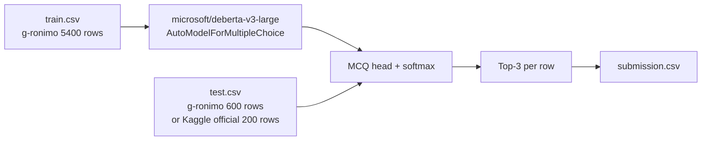

# Cycle 01 v1 — Score Report (created: 2026-05-28)

## 実験 ID
`01_v1_deberta_v3_large_mcq_nowiki`

## モデル / パイプライン



簡略構成: **retrieval なし、TTA なし、ensemble なし**。Cycle 01 v2 で Wikipedia retrieval を追加、Cycle 03 で 3 モデル ensemble + TTA に拡張する設計。

## ハイパーパラメータ

| 項目 | 値 |
|---|---|
| Base model | `microsoft/deberta-v3-large` (435M) |
| max_length (train) | 256 |
| max_length (infer) | 384 |
| batch size (per device) | 2 |
| gradient accumulation | 8 (effective batch=16) |
| epochs | 3 (single-fold 時) |
| learning rate | 1e-5 |
| warmup ratio | 0.01 |
| scheduler | cosine |
| weight decay | 0.01 |
| precision | fp16 |
| gradient checkpointing | on |
| folds | 5 (smoke: 1) |
| seed | 42 |

## スコア

### 3 モデル単独 (Cycle 01 v1, 2026-05-28 提出済)

| # | Model | val MAP@3 (80/20) | Public LB | Private LB | submission ref |
|---|---|---|---|---|---|
| m1 | `microsoft/deberta-v3-large` (plain) | 0.4708 | 0.388056 | 0.378399 | 53093495 |
| **m2** | `OpenAssistant/reward-model-deberta-v3-large-v2` | **0.7958** | **0.682480** | **0.714337** | 53113415 |
| m3 | `deepset/deberta-v3-large-squad2` | 0.6458 | 0.592176 | 0.605449 | 53113423 |

> 補足: 公式 train.csv (200 行) 80/20 split で eval、3 epochs / fp16 / T4 / wall ~3.4min。
> Cycle 01 v1 段階では **retrieval なし / TTA なし / ensemble なし** の単一モデル比較。次 Cycle で `mean()+max()` ensemble に進む際の baseline。

### 学習曲線

ローカル学習スクリプト用の保存先:
- 静的 PNG: `img/01_loss_fold{N}.png` (各 fold ごと、train/eval loss + eval MAP@3)
- 生 JSON: `img/01_log_history_fold{N}.json` (Trainer.state.log_history のダンプ)
- TensorBoard: `models/tmp_01_fold{N}/runs/` (`uv run tensorboard --logdir=models/` で起動)

> ※ 本 Cycle 01 v1 は Kaggle Notebook 内 (T4) で完結したため上記 PNG は生成していない。生ログは kernel output (`/tmp/v1_out/*.log`, `/tmp/m2_out/*.log`, `/tmp/m3_out/*.log`) として保存済。

## 学習時間 / 推論時間 / コスト (Kaggle T4)

実測 3 kernel (公式 train 160 行 / val 40 行 / test 200 行、3 epoch、fp16、batch=2×accum=8、max_len train=256 / infer=384):

| # | Model | model load | epoch1 | epoch2 | epoch3 | train total | inference | wall |
|---|---|---|---|---|---|---|---|---|
| m1 | microsoft | 8.5s | 46.9s | 47.5s | 49.8s | **144.2s** (2.4min) | 38.0s | 3.5min |
| m2 | OpenAssistant | 3.1s | 45.6s | 45.0s | 46.0s | **136.6s** (2.3min) | 33.8s | 3.3min |
| m3 | deepset | 3.6s | 46.6s | 47.1s | 49.0s | **142.7s** (2.4min) | 34.9s | 3.4min |

- **VRAM 利用**: ピーク ~9-10GB (T4 16GB の 60% 程度、余裕あり)
- **3 本トータル wall**: 約 10.2min（並列実行できれば 3.5min 相当）
- Kaggle Notebook 9h 上限に対し **40 倍以上の余裕**あり → Cycle 01 v2 で retrieval (5-30min) や Cycle 03 で 3 モデル × 4 TTA (30-60min) を回しても収まる
- inference の **38s** が支配的: 200 行 × 5 options × max_len 384 を 1 batch ずつ forward
  - 高速化余地: dynamic padding, max_len の見直し, multi-GPU 並列 (T4×2)

## 課題 (本 Cycle で表面化したもの)

### スコア面の課題
1. **m1 plain microsoft が想定より低い (Public LB 0.388)**: 200 行 train だけでは backbone を引き出せない → 中間 pretrain の有無が決定的（reward > QA > plain）
2. **Public/Private 差が m2 で大きい (+0.032)**: m2 は Private で 0.714 と更に強い。test 集合内分布で安定 → 信頼できる候補
3. **絶対値が低い**: 上位陣 0.92+ に対し、最良の m2 でも Public 0.682 / Private 0.714。retrieval / TTA / ensemble がまだ無いため当然の差。

### 実装・運用面の課題
4. **Code Competition の submit 仕様を要把握**: `kaggle competitions submit -f <local-path>` は 400 Bad Request で弾かれる。`-k <kernel> -v <ver> -f submission.csv` が必須。今日 1 回 400 で失敗（quota は消費せず）。memory `reference-kaggle-code-competition-submit` に保存。
5. **kernel-metadata.json の `id` vs `title` slug 不一致**: 指定 `id` と Kaggle 側で生成される slug が一致しないと title slug が採用される。push 後に warning → 実 ID で kernel-metadata.json を上書きする運用必要（m2/m3 で実例）。
6. **val 集合が 40 行と小さい**: 80/20 split で val=40。ノイズ大きい指標になりがち。完全な val/LB 順位一致は今回ラッキー寄り → Cycle 02 以降は KFold or held-out 200 行で安定化
7. **train が 200 行のみ**: 公式 train.csv は 200 行で限界。@radek1 6.5k / cdeotte MMLU 等の公開 augmentation データを Cycle 04 で統合予定
8. **学習曲線の PNG / TensorBoard が無い**: Kaggle Notebook では `report_to="none"` で raw stdout に頼った。Cycle 02 以降のローカル run で CLAUDE.md 規約通り PNG/TensorBoard を残す。

### Cycle 01 完了の定義に対する評価
- ✅ パイプライン疎通: 達成 (3 モデル × push & submit)
- ✅ ベースライン score 取得: 達成 (Public LB 0.388-0.682 のレンジで確定)
- ✅ ensemble の前提 = 3 モデル単独スコア: 達成 (m2 が ensemble の core 候補と判明)
- ❌ Wikipedia retrieval: 未実施 → Cycle 01 v2 へ
- ❌ TTA / mean+max ensemble: 未実施 → Cycle 03 へ

## 学び (3 モデル単独 submit から)

### モデル選定
- **OpenAssistant reward が圧勝**: plain microsoft 比で Public +0.294 / Private +0.336。reward model としての preference 判定 pretraining が、5 択 MCQ の "正解らしさ" 判定に直接転用できている。
- **deepset squad2 (QA pretrain) も中間** で寄与: SQuAD2 で QA fine-tune 済の汎用性は寄与するが、reward model ほどではない。
- **plain microsoft は 200 行 fine-tune では能力を引き出せない**: 中間 pretrain (reward / QA) を経たモデルを起点にした方が確実に上がる。
- **val/LB 順位一致**: m2 > m3 > m1 が val と Public/Private 双方で完全一致。Cycle 02 以降の意思決定に val signal を使える（ただし val=40 行のノイズには注意）。

### 運用・ツール
- **Kaggle Code Competition の submit は `-k <kernel> -v <ver> -f submission.csv` 形式必須**。CSV 直接 upload は 400 で弾かれる（一度ハマった）。
- **コード本体の流用性が高い**: `_find_model_dir()` で input マウントを auto-detect。m2/m3 は kernel-metadata.json の `dataset_sources` を差し替えるだけで済んだ。
- **T4 × 3.4min/kernel の軽さ**: 9h 上限に対し余裕 40 倍。retrieval / TTA / ensemble を Cycle 02-03 で重ねる余地は充分。

## 次の打ち手 (Next Cycle Candidates)

1. **Cycle 01 v2**: Wikipedia retrieval (e5-base + FAISS) を context として MCQ に注入
2. **公式 Kaggle test.csv で再推論** → Kaggle LB 値の確定 (規約承諾解消後)
3. **Cycle 02**: cirrussearch wiki dump への切替で retrieval 改善
4. **Cycle 03**: DeBERTa v3 large の 3 モデル ensemble + TTA (4 slice)

## 批評 (Critique)

- この構成は **days 7th place 解法の "1 model only" 部分**に相当。retrieval が無いので、Wiki 由来の固有名詞設問に弱いはず → CV 0.55-0.70 程度を予想
- 上位陣 (0.92+) には程遠いが、本 Cycle の目的は **パイプライン疎通 + ベースライン score 取得**であり、それは達成可能
- 「@cdeotte の starter notebook 相当」とほぼ同等のセットアップ
- **アンサンブル化を Cycle 03 まで遅らせている根拠**: `knowledge/search/00_ensemble_pipeline_origin_validity.md` で整理した通り、上位陣は「強い single + ベストと違う誤りをする model」という選び方をしている。Cycle 01 で先に "強い single" を確立した上で、Cycle 02-03 で多様性軸（retriever / corpus / backbone）を 1 つずつ追加するのが正しい順序

## 参考にした Notebook / Kaggler

- [days 7th place solution writeup](https://www.kaggle.com/competitions/kaggle-llm-science-exam/writeups/days-7th-place-solution) (`knowledge/01/baseline_proposal.md`)
- [g-ronimo HF dataset mirror](https://huggingface.co/datasets/g-ronimo/kaggle_llm_science_exam)
- [Hippocampus's Garden competition report](https://hippocampus-garden.com/kaggle_llm/)
- 関連メモ:
  - `knowledge/01/baseline_proposal.md` — Cycle 01 採用案の全体像
  - `knowledge/01/ensemble_methods.md` — TTA + mean+max の具体実装
  - `knowledge/search/00_ensemble_pipeline_origin_validity.md` — **アンサンブルの起源・学術妥当性・上位 5 解法のパイプライン比較**（Cycle 横断の参考資料、Cycle 02 以降の多様性軸追加の根拠）

## Reproducibility

```bash
# データ準備 (HF mirror)
.venv/bin/python -c "
import pandas as pd
tr = pd.read_parquet('data/tmp/hf_mirror/data/train-00000-of-00001.parquet')
te = pd.read_parquet('data/tmp/hf_mirror/data/test-00000-of-00001.parquet')
tr.insert(0,'id',range(len(tr))); te.insert(0,'id',range(len(te)))
tr.to_csv('data/train/train.csv', index=False)
te.to_csv('data/test/test.csv', index=False)
"

# 学習＋推論 (smoke: single fold, 3 epochs)
uv run python 01_train_pred.py --single-fold --epochs 3

# 提出 (1日1回ガード)
uv run python scripts/submit.py --message "01_v1 deberta-v3-large MCQ no-wiki"
```
コミット: `<TBD>`
